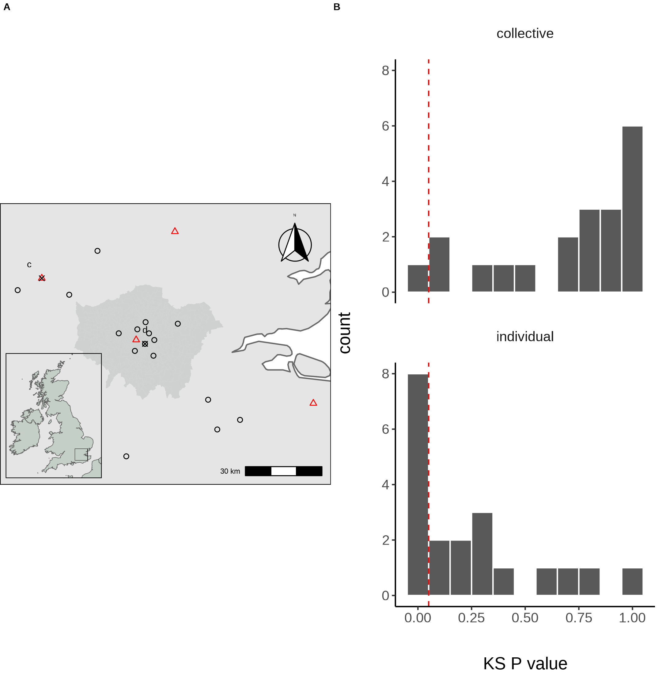
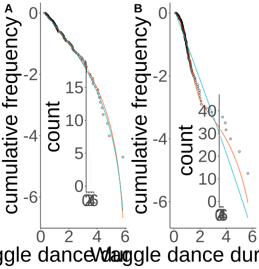
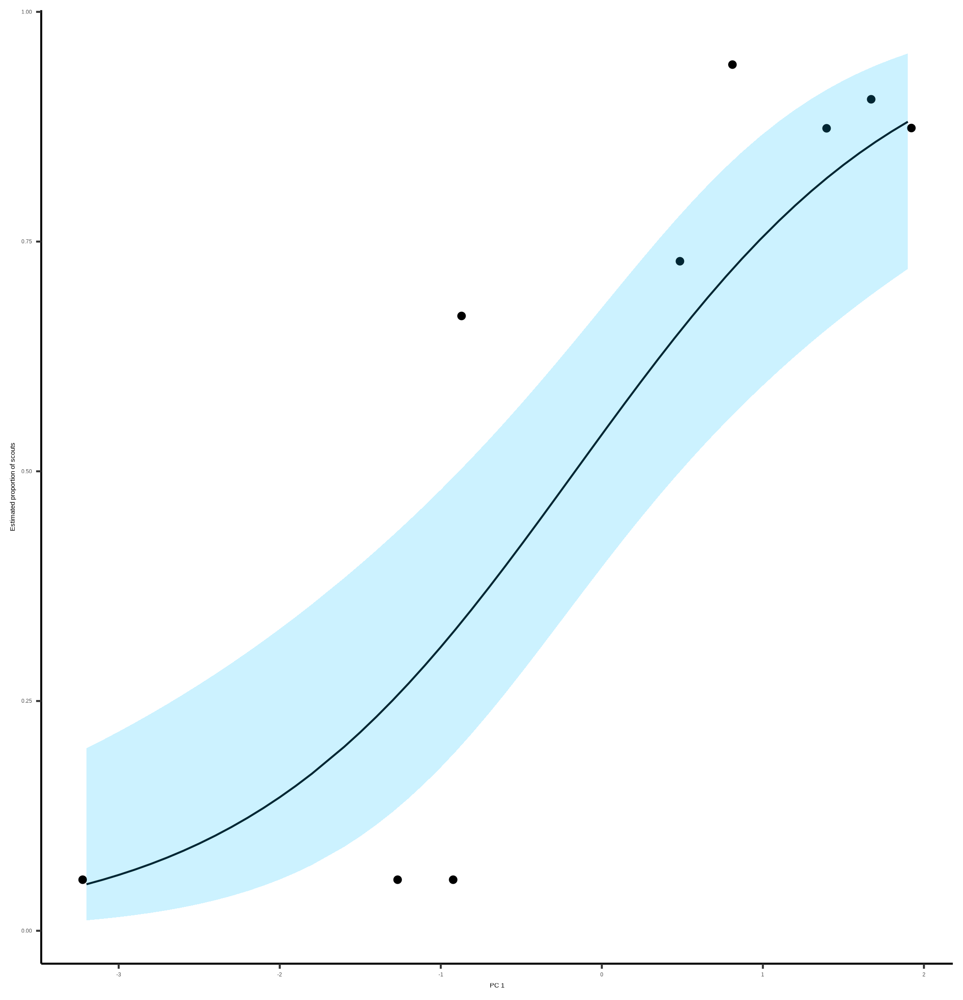

<style type="text/css">
.caption {
    font-size: small;
}
.refs {
    font-size: small;
}
.fullslide img {
  margin-top: -85px;
  margin-left: -60px;
}
</style>

```{r setup, include=FALSE}
knitr::opts_chunk$set(echo = FALSE)
library(showtext)
showtext_auto()

knitr::opts_chunk$set(
  collapse = TRUE,
  comment = "#>",
  fig.path = "man/figures/README-",
  out.width = "100%"
)
library(ggplot2)
theme_set(
  theme_classic() +
    theme(
      text = element_text(size = 18)
    )
)

library(kableExtra)
library(tidyr)
library(dplyr)
library(flextable)

set_flextable_defaults(
  big.mark = " ",
  font.size = 10, theme_fun = theme_vanilla,
  padding.bottom = 6,
  padding.top = 6,
  padding.left = 6,
  padding.right = 6
)

load("../results/pls-loadings.RData")
argi.rural.loadings <- tibble(
  "Land-use" = names(agrirural_loadings$loadings),
  "PC1" = agrirural_loadings$loadings
)

urban.loadings <- tibble(
  "Land-use" = names(urban_loadings$loadings),
  "PC1" = urban_loadings$loadings
)

```

## Honeybees forage collectively

## Should you always work together?

## Objective

## How to capture individual vs collective foraging?

## Simulation

```{r, fig.cap="Figure 1. A. Outline of scout foraging. Scouts leave the hive on a random flight path (white lines) and continue until they encounter a resource (flowers in the figure). B. Outline of foraging with recruitment. Scouts continue to identify resources but recruits sample available dances provided by recruits and other scouts. C. Log inverse frequency distribution of foraging distances reported by scouts. D. Log inverse frequency distribution of foraging distances reported by recruits."}
knitr::include_graphics("../results/figures/simulation.png")
```

## Our model

## Model results

```{r, out.width="500px", out.height="500px", fig.cap="Figure 3. A. Location of study hives in Southern England coloured by which model, collective (black circles) or individual (red triangles) provided the best explanation of the data as indicated by lowest AIC score. Sites STU and ZSL (C & D) are marked. Inset plot shows the location of the sites within the UK. B. Distribution of goodness of fit confidence values for each model fit to waggle dance derived foraging distances from each site. P value is derived from a bootstrapped two-sided KS test comparing the fitted model predictions to the empirical data. The red dashed line marks the significance threshold of 0.05. Values greater than 0.05 indicate no statistically significant difference is observed between the model and the data, indicating the model provides a good fit to the data."}

```
## Model results

```{r, fig.cap="A. Model fits to waggle dance derived foraging distances collected from the ZSL hive along with histogram showing distribution. B. Model fits to waggle dance derived foraging distances collected from the STU hive along with histogram showing distribution. Model fits show the compliment cumulative frequency distribution, giving the probability of sampling a value greater than or equal to x."}

```

## Honeybees don't always forage collectively

## How does land-use influence waggle dance use?

## Agri-rural land-use

<div style="float: left; width: 45%;">

```{r, fig.cap="Estimated proportion of scouts for each site in the Agri-rural landscape against the first principle component from a Partial Least Squares analysis of land-use type. A beta regression shows the relationship (black line) between PC1 and the proportion of scouts ($R^2$ = 0.6, $\\phi$ = 4.9, p < 0.05), with 95% CI shown by the blue shaded area."}

```

</div>

<div style="float: right; width: 50%;">

```{r, agri.rural.loadings}
argi.rural.loadings %>%
  mutate(PC1 = round(PC1, 3)) %>%
  mutate(
    PC1 = cell_spec(
      PC1,
      bold = ifelse(
        PC1 > agrirural_loadings$cutoff,
        TRUE,
        ifelse(
          PC1 < -agrirural_loadings$cutoff,
          TRUE,
          FALSE
        )
      )
    )
  ) %>%
  kbl(
    caption = "Land-use type loadings for the first principle component on the Agri-rural sites",
    escape = F
  ) %>%
  kable_classic(full_width = F)
```

</div>


## Urban land-use

<div style="float: left; width: 45%;">

```{r, fig.cap="Estimated proportion of scouts for each site in the urban landscape against the first principle component from a Partial Least Squares analysis of land-use type. A beta regression shows the relationship (black line) between PC1 and the proportion of scouts ($R^2$ = 0.61, $\\phi$ = 7.4, p < 0.05), with 95% CI shown by the blue shaded area."}
knitr::include_graphics("../results/figures/urban_fit.png")
```

</div>

<div style="float: right; width: 50%;">

```{r, urban.loadings}
urban.loadings %>%
  mutate(PC1 = round(PC1, 3)) %>%
   mutate(
    PC1 = cell_spec(
      PC1,
      bold = ifelse(
        PC1 > agrirural_loadings$cutoff,
        TRUE,
        ifelse(
          PC1 < -agrirural_loadings$cutoff,
          TRUE,
          FALSE
        )
      )
    )
  ) %>%
  kbl(
    caption = "Land-use type loadings for the first principle component on the Urban sites",
    escape = F
  ) %>%
  kable_classic(full_width = F)
```

</div>

## Land-use type influences waggle dance use

## Overall conclusion

## Thank you for listening, Questions?

### Acknowledgments
Vincent Jansen, Elli Leadbeater, Ash Samuelson

### References
<div id = "refs" class = "refs columns-2"></div>