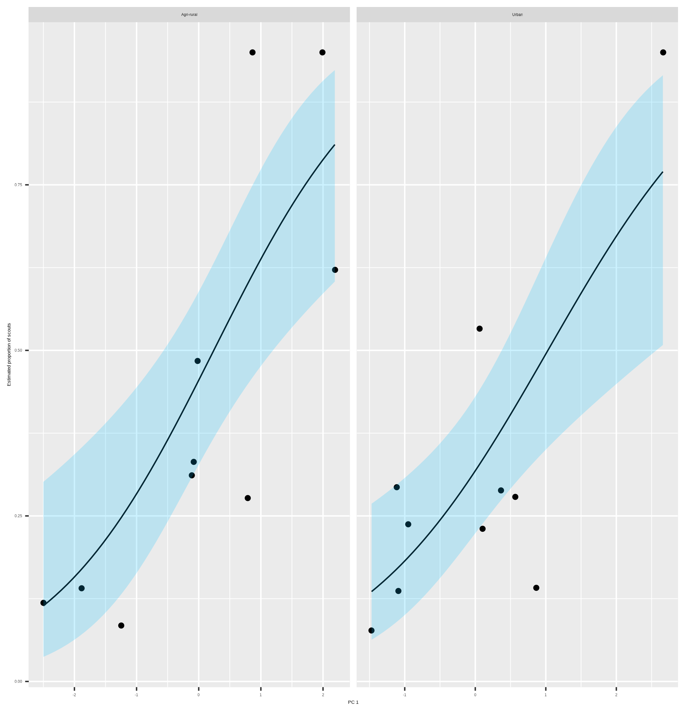

```{r setup, include=FALSE}
knitr::opts_chunk$set(echo = FALSE)
library(showtext)
showtext_auto()

knitr::opts_chunk$set(
  collapse = TRUE,
  comment = "#>",
  fig.path = "man/figures/README-",
  out.width = "100%"
)
library(ggplot2)
theme_set(
  theme_classic() +
    theme(
      text = element_text(size = 18)
    )
)

library(dplyr)
library(kableExtra)
library(flextable)
library(tibble)
```


Notes from Elli.

The big thing is collective vs individual information use and what caused the evolution of sociality. With honeybees we have an advanced dance language. Wider context question is of how the waggle dance has evolved / what are the conditions that lead to the evolution of the waggle dance, as it has only happened once. This is sort of what Dornhaus, Herman and Visscher are hinting at.

Gruter's stuff shows individuals can vary their use of the dance depending on foraging experience. The hive disorientation stuff shows that a collective can do better without the dance in some environments. Suggests honeybees flexibly use the dance in colony foraging. However, despite this we have no way of quantifying the extent to which honeybees use the dance. We designed a method to quantify its use and fit it against a large empirical data set.

Results are that honeybees in the majority of cases forage collectively but in some sites use personal information. We can then apply the results to evaluate how this varies across environments.


$$
\pi r^2
$$

# Abstract

Collective foraging requires that the emergent behaviour of an animal group takes a form that extends beyond the superposition of numerous individual contributions [@Sumpter2006], such that complexity is achieved at the level of the group or system, rather than the individual. Whilst collective foraging has been suggested to occur for many animal species (insert refs list), establishing if, and to what degree, animal groups make collective decisions remains a challenge. Here, we present a model of foraging by honey bees that can be used to distinguish collective decisions from individual-driven group behaviour. By confronting this model with waggle dance data from twenty hives, collected across two years, we can infer to what extent each colony depends on collective foraging vs individual decision-making. Our model both illustrates how a social insect group achieves superorganismal behaviour, and provides a tool to study variation in the occurrence of this behaviour across ecological scenarios.

# Main

Collective decision making provides animals groups with the ability to pool individual information and make more informed decisions. Despite an enhanced processing capacity, not every circumstance requires a collective response. In many cases, animal groups do better when individuals prioritise their own personal information over social information provided by conspecifics [@King2007; @Rieucau2011; @Gruter2013]. Identifying the conditions which favour different information use strategies remains a key challenge, both for determining what conditions likely lead to the evolution of collective decision making and for understanding how animal groups might interact in an increasingly anthropomorphic world. Assessing the importance of different information use strategies is not trivial, requiring the actions and decision making of a collective to be compared with that of individual actors. Making such comparisons demands observations of individual and collective behaviours. A side from limiting the group size that can be studied, in many cases we can observe one, or the other, but not both.

In honey bees, foraging is collectively coordinated via the famous "waggle dance", which conveys the location of a profitable resource as a vector of distance (duration of the waggle run) and direction (angle of the dance) [@Frisch1993]. Resource “quality” is not encoded in the form of the dance itself, but in the number of waggle runs performed [@Frisch1993; @Boch1956; @Esch1961; @Seeley1994; @Seeley2000]. Although bees that follow dances do not specifically interpret this information on an individual level [@Hasenjager2021], the resulting over-representation of high-quality sites on the dance-floor means that they are more likely to encounter dances that advertise better forage [@Seeley1995]. This creates a feedback mechanism through which the hive processes the information collected and proportionally selects the most profitable resources [@Seeley1994A].

Despite the efficiency benefits the waggle dance reportedly provides, its contribution to colony foraging success remains unclear. In many situations, colonies that are prevented from communicating via dance behaviour achieve equal or even greater foraging success than their wild-type counterparts [@Sherman2002; @Dornhaus2004; @Price2019]. In some ecological circumstances, individuals that forgo waiting for dance information in favour of individual search, termed “scouting”, may find food more quickly, and evidence suggests that bees adopt this strategy if the benefits of dance-following drop [@Gruter2008]. Whilst direct experiments can show how individuals respond to different scenarios [@Guter2011; @Gruter2014], empirically evaluating a collective foraging strategy in response to different environmental conditions remains a challenge.

Here, we describe a model to quantify waggle dance use in honey bee foraging and fit it to a large empirical waggle dance dataset. After estimating the extent to which colony foraging occurs individually or collectively, we investigate the influence different land-use types have on waggle dance use. Our methods provide novel evidence for collective honey bee foraging and a framework to evaluate how environmental conditions influence waggle dance use in honey bees.

Whether an individual forager follows a waggle dance from the dance floor or finds a resource for themselves, all foragers report resource information on the dance-floor. Consequently, the difference in foraging behaviours between individuals using the dance and individuals relying on personal information should manifest itself in the pattern of dances reported on the dance-floor. To evaluate this idea, we simulated honey bees foraging in a landscape using both personal and waggle dance information (Fig. 1). As which individuals foraged under what strategy is known in the simulation, we can compare the distributions of foraging distances reported on the dance floor. Figs 1c and 1d show that the shapes of the resource distance distributions under the two simulated scenarios are very different. The distribution of the first simulation is akin to that of an exponential distribution (Fig. 1 C), which is the nearest neighbour distance distribution for foragers operating in a one-dimensional environment (see methods). The distribution of the distances reported by recruits (Fig. 1 D) is appears to resemble a Rayleigh distribution which is the nearest neighbour distribution of a two-dimensional environment (see methods).

```{r, fig.cap="Figure 1. A. Outline of individual foraging. Foragers leave the hive on a random flight path (white lines) and continue until they encounter a resource (flowers in the figure). B. Outline of foraging with recruitment. Some foragers (scouts) continue to identify resources but others (recruits) sample available dances provided by scouts and other recruits. C. Log inverse frequency distribution of foraging distances reported by scouts. D. Log inverse frequency distribution of foraging distances reported by recruits."}
knitr::include_graphics("../results/figures/simulation.png")
```

Simulating honey bee foraging under a strategy of independent foraging and waggle dance following shows the shape of the foraging distance distributions reported on the dance-floor carries information about the extent to which honey bee colonies collectively make foraging decisions. On a real honey bee dance-floor, the distribution of distances is modified through the profitability of a resource reported. Honey bees achieve this by measuring the energetic efficiency of a foraging trip through the ratio of energetic gain to energetic cost [@Seeley1994A]. Combined with the distance distributions identified from our simulations, we form a prediction of the distances reported on the dance-floor as a superposition of independent and waggle dance foraging (Fig 2, see Methods). This yields two different models: a collective model demonstrating collective decision making, comprised of the proportion of dances following an individual foraging strategy (scout) along with the proportion of dances following a waggle dance use strategy (recruit), and an individual model where decisions are made entirely individually (scout only) (Fig 2). By confronting these models with waggle dance data we can infer to what extent colony foraging depends on individual or collective decision making.

```{r, fig.cap="Figure 2: Model of honey bee foraging. Flowers advertised by scouts are distributed exponentially (a). These dances are advertised on the dance floor (b) in relation to their profitability, meaning sampling recruits are biased to the more profitable (and closer) resources (c). After visiting advertised resources, recruits also dance for them leading to higher recruitment (d) which overall skews the distribution of distances reported on the entire dance floor (e)."}
knitr::include_graphics("../results/figures/foraging-model.png")
```

To evaluate collective decision making in honey bee colonies foraging on 'natural' landscapes we analysed a dataset of 3378 waggle dance observations from 20 observation hives between April-September 2017, previously described in [@Samuelson2021]. Hives were situated at different locations in the Southeast of England (see methods, figure 3A) and were visited every two weeks for a period of 24 weeks. On each visit, two hours of continuous waggle dance data were recorded by training a camcorder onto the dance floor. The footage of the dances was decoded manually to identify reported foraging locations [@Couvillon2012; @Schurch2019]. For each site we fit both the collective and individual models. We used model selection to determine which model provided the better explanation of the data and model fit to determine if the model provided a good explanation of the data.

For 17 out of 20 study hives, a model of collective foraging provided a better explanation of the data than one of individual foraging (Fig. 3a), however, in 3 sites the individual model provided the best explanation of foraging patterns. Across 17 of the sites, the collective model was not statistically different from the empirical foraging distances, whereas the scout model was significantly different to the data in 8 of the sites (Fig. 3.b). Sites ZSL (Fig. 3c) and STU (Fig 3d) are representative examples showing the model fits. For ZSL the collective model describes foraging distances extremely well and no significant difference is observed between the model and empirical foraging distances (AIC: 569, Bootstrapped KS statistic: d = 0.06, p = 0.395). In contrast the scout model and empirical foraging distances are significantly different, providing a worse explanation of the data (AIC: 622, KS statistic: d = 0.122, p < 0.01). For STU the collective model provides a slightly better fit (KS: d = 0.04, p = 0.999) than the scout model (KS: d = 0.05, p = 0.998), however, the scout model is more parsimonious (AIC: 388) than the collective model (AIC: 393).

```{r, fig.cap="Figure 3. A. Location of study hives in Southern England coloured by which model, collective (black circles) or individual (red triangles) provided the best explanation of the data as indicated by lowest AIC score. Sites STU and ZSL (C & D) are marked. Inset plot shows the location of the sites within the UK. B. Distribution of goodness of fit confidence values for each model fit to waggle dance derived foraging distances from each site. P value is derived from a bootstrapped two-sided KS test comparing the fitted model predictions to the empirical data. The red dashed line marks the significance threshold of 0.05. Values greater than 0.05 indicate no statistically significant difference is observed between the model and the data, indicating the model provides a good fit to the data. C. Model fits to waggle dance derived foraging distances collected from the ZSL hive along with histogram showing distribution. D. Model fits to waggle dance derived foraging distances collected from the STU hive along with histogram showing distribution. Model fits show the compliment cumulative frequency distribution, giving the probability of sampling a value greater than or equal to x."}
knitr::include_graphics("../results/figures/sites_model_plot.png")
```

Our results indicate that, whilst foraging decisions are primarily reached collectively through the use of the waggle dance, in some circumstances, colony foraging is best explained by a model of individual foraging. This suggests that in some environments, honey bees actively ignore the waggle dance and instead prioritise the use of personal information. Previous empirical studies have shown that individual foragers flexibly alter their use of waggle dance information in response to unrewarding feeders [@Gruter2011], suggesting experience drives information use at the individual level. Evaluating how these individual decisions influence the collective, however, has always been a challenge due to fact that it is effectively impossible to track an individuals foraging behaviour over a landscape.

As well as providing direct evidence that honey bees forage collectively according to the widely accepted theory (refs), our results demonstrate that waggle dance use depends on environmental context. Although this has been suspected for some time (refs), empirical evidence that colonies foraging on the landscape might regulate the use of the waggle dance have relied on the method of dance disorientation (refs for dance disorientation study), whereby a colony is disoriented to remove the spatial component of the waggle dance. Foraging success, measured as quantities of nectar or pollen retrieved, is then compared to an undisturbed colony in the same environment to determine what dance use strategy is the most effective. Whilst this method allows for an evaluation of whether or not colonies forage more effectively with or without the dance in a given environment, whether a colony actively regulates waggle dance use in response to the environment is not directly shown. In showing that foraging patterns in three of our sites are best explained by individual foraging, our results demonstrate honey bee colonies tune waggle dance use in relation to environmental factors.

As our model predicts the proportion of dances coming from an individual or collective foraging strategy, its fit to waggle dance data provides a tool to estimate a colonies use of the waggle dance.

To evaluate how waggle dance use is being influenced by the environment, we compared the different land-use types for each site to the estimated proportion of dances stemming from an individual foraging strategy (proportion of scout dances). Each site used in this study has a unique landscape comprised of different land-use types. We first classified the different land-use types of the area surrounding each site to obtain a standardised land-use profile for the urban and agri-rural environments. As many of the resulting land-use types covaried with each other, we performed a Partial Least Squares (PLS) analysis to determine the combination of land-use types which explained the most variation in the proportion of scout dances.

```{r, fig.cap="Figure 4. Estimated proportion of scouts for each site in the Agri-rural (left) and Urban (right) landscapes against the first principle component from a Partial Least Squares analysis of land-use type. A beta regression shows the relationship (black line) between PC1 and the proportion of scouts, with 95% CI shown by the blue shaded area."}

```

In the Agri-rural environment a single PC explained ~60% of the variation in the proportion of scouts (beta regression: $R^2$ = 0.6, $\phi$ = 4.9, p < 0.05, Fig. 4). This PC correlates positively with arable land and negatively with non-agricultural unmanaged green space, built up areas and water. Arable land is typically nutritionally poor for honey bees (ref). On the contrary, non-agricultural unmanaged green space is typically nutrient rich, as are built up areas in agri-rural environments, which often have gardens with ample flowers available for pollinators (ref). Water also correlated negatively with the estimated proportion of scouts, possibly due to river and pond banks providing good floral resources for pollinators (ref). Combined, these results suggests when resources are sparse and difficult to find, as with arable land-use, individuals value personal information more than when easier to find, as with the non-agricultural unmanaged green space, built up areas and water.

```{r, agri-rual-loadings}
set_flextable_defaults(
  big.mark = " ",
  font.size = 10, theme_fun = theme_vanilla,
  padding.bottom = 6,
  padding.top = 6,
  padding.left = 6,
  padding.right = 6
)

load("../results/pls-loadings.RData")
argi.rural.loadings <- tibble(
  "Land-use" = names(agrirural_loadings$loadings),
  "PC1" = agrirural_loadings$loadings
)

urban.loadings <- tibble(
  "Land-use" = names(urban_loadings$loadings),
  "PC1" = urban_loadings$loadings
)

argi.rural.loadings %>%
  mutate(PC1 = round(PC1, 3)) %>%
  mutate(`Land-use` = gsub("\\.", " ", `Land-use`)) %>%
  flextable() %>%
  set_caption(
    "Land-use type loadings for the first principle component on the Agri-rural sites. Bold face indicates loadings that contribute more than would be expected under a null hypothesis of equal contribution"
  ) %>%
  set_table_properties(layout = "autofit") %>%
  bold(
    i = ~ PC1 > agrirural_loadings$cutoff |
      PC1 < -agrirural_loadings$cutoff,
    j = "PC1"
  )
```

A similar effect is also observed in the urban environment, where a single PC explained ~61% of the variance in the proportion of scouts (beta regression: $R^2$ = 0.61, $\phi$ = 7.4, p < 0.05, Fig. 4). This PC correlates positively with continuos central land, dense residential land and water, whilst correlating negatively with sparse residential and amenity grassland. This relationship appears to be largely driven by a single site showing a model of only individual foraging as the best fit. As with the agri-rural land-uses, these results indicate when resources are sparse, as could be expected in continuos central and dense residential land, where there is limited space for floral resources, a colony emphasises the use of personal rather than social information. However, when resources are more abundant, as could be expected in sparse residential areas and amenity grasslands, a colony appears to increase the use of information contained in the waggle dance. Unlike in the agri-rural environment, water correlates positively with a higher use of the waggle dance. This likely indicates that the banks of urban water ways are less nutritionally rich than in agri-rural landscapes.

```{r, urban.loadings}
urban.loadings %>%
  mutate(PC1 = round(PC1, 3)) %>%
  mutate(`Land-use` = gsub("\\.", " ", `Land-use`)) %>%
  flextable() %>%
  set_caption(
    "Land-use type loadings for the first principle component on the urban sites. Bold face indicates loadings that contribute more than would be expected under a null hypothesis of equal contribution"
  ) %>%
  set_table_properties(layout = "autofit") %>%
  bold(
    i = ~ PC1 > urban_loadings$cutoff |
      PC1 < -urban_loadings$cutoff,
    j = "PC1"
  )
```

In both the agri-rural and Urban environments, land-use types which associate with resource scarcity correlate positively with a higher proportion of scouts, whilst those which correlate with resource abundance correlate with a lower proportion of scouts, indicating a greater use of the waggle dance. These results appear to follow what is predicted under theoretical models: in landscapes where resources are likely to more difficult to find, a colony tends to have a higher number of scouts than in landscapes where resources should be easier to locate [@Dornhaus2006; @Beekman2008]. However, it is important to note that other combinations which didn't show as having a significant association with the first principle component could have just as well fit into this argument, arguably better than others. In both the agri-rural and urban environments water seems to correlate in contrasting ways with the proportion of scouts. This could be due to differences in the floral richness of urban and agri-rural water ways (reff), however, if land-use type is to be taken as a proxy for floral availability, other variables such as parks, allotments and cemeteries in the urban environment and fruit or Oil Seed Rape in the agri-rural environment might be expected to be included in the first PC over water. An alternative explanation could be that water acts as barriers between land-use types and so gets bundled into the association (more thought on this needed i think).

To what extent social information is used when making foraging decisions, as well as the value of personal information, has been a matter of considerable debate (refs). Here, we demonstrate that the analysis of waggle dance data can make an important contribution to this debate and provide a methodology to further evaluate how honey bees use this unique behaviour. Recent advances in computational methods have allowed individuals to be tracked within colonies in ways which would be almost impossible to do by hand (Langraff paper). When combined with social network analyses, the use of such technologies have shed new light on many in colony behaviours. By piecing together the behavioural response of individuals into a mathematical description of colony foraging, the model outlined here extends our ability to predict individual behaviour beyond the colony walls and in to the environment. With the advances in the decoding of the waggle dance through automated methods [@Wario2017], we face the prospect of waggle dance data becoming “big data”. Our methodology provides a means of analysing such large data sets and gleaning useful information on the importance of such data to inform the debate about the importance of social information, as well as providing useful colony metrics of foraging activity.

# References
