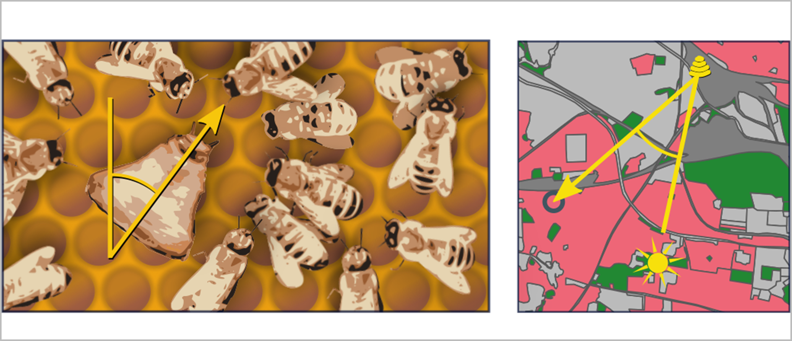
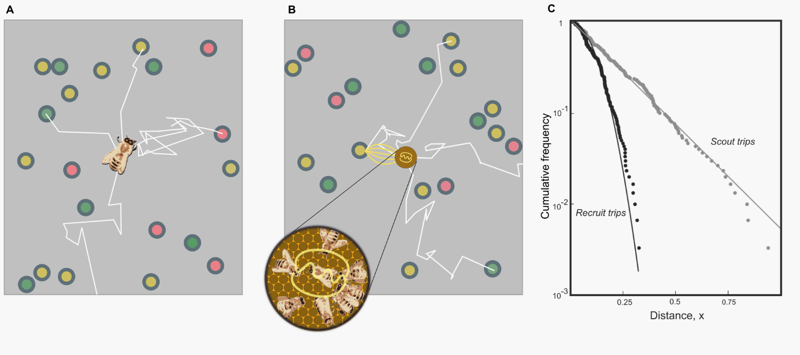
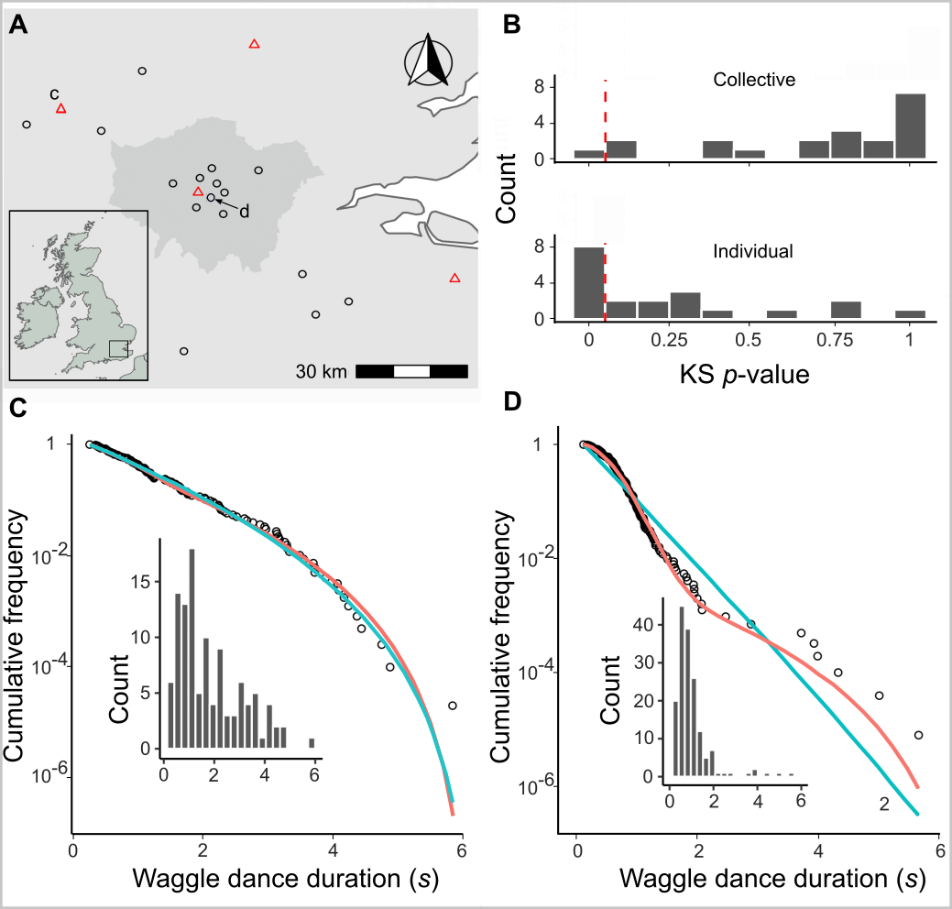
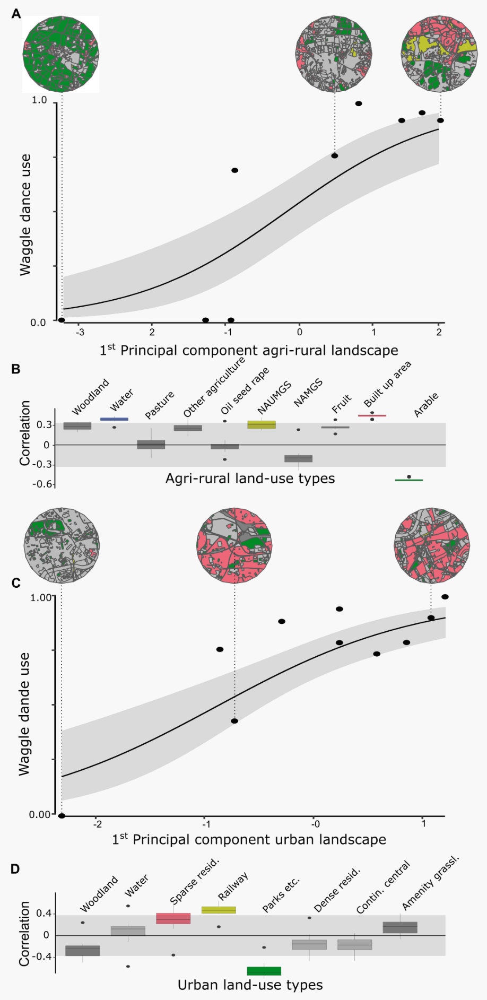

```{r setup, include=FALSE}
knitr::opts_chunk$set(echo = FALSE)
library(showtext)
showtext_auto()

knitr::opts_chunk$set(
  collapse = TRUE,
  comment = "#>",
  fig.path = "man/figures/README-",
  out.width = "100%"
)
library(ggplot2)
theme_set(
  theme_classic() +
    theme(
      text = element_text(size = 18)
    )
)

library(dplyr)
library(kableExtra)
library(flextable)
library(tibble)
```

# Abstract

Honeybee foraging is an extraordinary collective behaviour that is directed through the waggle dance communication system, whereby colony foraging effort is allocated through a series of feedback loops. Here, we present a mathematical framework to explain how the intrinsic process of the waggle dance can allow a colony to exploit different landscape types. From waggle dance observations, we infer the proportion of dances performed by bees that forage individually, and those that forage collectively. By applying this methodology to waggle dance data from twenty hives, we show our model closely fits real-world honeybee foraging patterns and we demonstrate that colonies vary their use of waggle dance information across different landscapes. Our methodology provides a tool to identify the ecological conditions in which honeybee colonies rely on dance communication, opening the door to large-scale experimental exploration of the selection pressures that may have driven the evolution of this remarkable collective behaviour.

# Introduction

No communication system is more celebrated than the honeybee waggle dance, yet there remains aspects of the behaviour which have not yet been quantified.

Within honeybee colonies, a series of simple rules determine when and how much bees perform the celebrated waggle dance (Fig. 1) mean that choices between feeding sites occur at the level of the group rather than the individual [@Seeley1994A]. For example, because the number of dance circuits performed by a bee on returning from a food source reflects the net energetic benefits of the trip, more of the colony's workforce will be recruited to the richer of two equidistant sources [@Seeley1991], or the closer of two equally rich sources [@Hasenjager2022], without requiring any individuals to go out and visit multiple resources to make a directly informed choice. This extraordinary system is a key example of how social insect colony behaviour can take on a form extending beyond that of the individual units [@Sumpter2006], functioning as a collective that makes decisions as a single entity.

Despite its intricacy and precision, a wealth of research now shows that foraging bees frequently do not use dance information to find forage sites [@Gruter2009]. Accordingly, in many situations, colonies that are prevented from communicating via dances achieve equal or even greater foraging success than their wild-type counterparts [@Sherman2002; @Dornhaus2004 @Dornhaus2006; @Gruter2013; @Price2019]. This plasticity in the use of collective behaviour is intriguing because it may provide clues as to the selection pressures that were critical in the evolution of the dance communication system.

Identifying the circumstances in which bees use the dance is likely to be a key step towards understanding when it is likely to afford fitness benefits at the colony level. Despite the amount of research interest that has focused on the proximate mechanisms of collective decision-making via dance communication, the ultimate evolutionary drivers of its unique evolution within *Apis* -unparalleled in even a single other social insect- remain obscure [@Price2015]. While it is likely that the spatiotemporal distribution of forage was key, some studies find the benefits of dance communication to be realized only in challenging environments where resources are clumped or ephemeral [@Sherman2002; @Dornhaus2004; @Dornhaus2006], while others find no effects of landscape heterogeneity [@Nurnberger2017], or that dancing comes at a cost in challenging environments [@Price2019] and is most beneficial when species richness is high [@Donaldson-Matasci2012].

Attempts to identify the circumstances in which dance communication is important have been challenging because they require constant monitoring of real-world colony weight [@Kirchner1998; @Sherman2002; @Dornhaus2006; @Gruter2013; @Nurnberger2017; @Price2019] -a noisy proxy of foraging success that is influenced by many other abiotic and biotic factors, including colony health- over ecologically credible time periods [@Schurch2014]. To do this at a scale that allows inter-colony variation in foraging environments at sufficient replication is a major logistical hurdle (but see [@Nurnberger2017]), particularly given that multiple landscape variables may interact to determine the utility of dance communication.

```{r, fig.cap="Figure 1. **The honeybee waggle dance carries information about the location of a resource.** The duration of the waggle run indicates the distance to the resource and the angle of the dance relative to the vertical indicates the direction of the resource (circle in right panel), relative to the direction of the sun [@Frisch1993]. Through the observation and decoding of the waggle dance, a colony's dance floor provides a unique opportunity to eavesdrop on the communication and decision making leading to collective foraging decisions. Overall resource “quality” -the net energetic gain of a foraging trip- is provided through the number of waggle runs performed [@Frisch1993; @Boch1956; @Esch1961; @Seeley1994; @Seeley2000]. Although bees that follow dances do not specifically interpret this information on an individual level [@Seeley1991], the resulting over-representation of high-quality sites on the dance-floor means that they are more likely to encounter dances that advertise better forage [@Seeley1995], and provides the colony with a mechanism to select the most profitable resources in their environment [@Seeley1994A]."}

```

Here, we present a method to determine the extent of waggle dance use in colony foraging within specific landscapes by identifying the proportion of foraging trips that are made by bees recruited through waggle dances. Our method examines the distribution of waggle run durations reported on the dance-floor and infers from its shape the relative contribution of dances for resources identified by individual search, "scouting" versus dances for resources found by following dances, “recruitment” [@Seeley1995]. Previously, the relative amount of scouting and recruitment trips have only been quantifiable by documenting foragers' individual search history, which requires tracking individual bees and is time -and labour- intensive [@Seeley1995]. Our methods provide an efficient means of quantifying collective behaviour with no requirement to manipulate hive orientations, assay foraging efficiency or document individuals' previous experience. As such, they can identify when colonies adopt a collective foraging strategy- a critical step towards understanding when such a strategy outperforms individual-level behaviour.

# Results

The patterns of waggle dance-encoded foraging distances might differ under scenarios where colonies rely on individual search versus recruitment. To show this, we simulated honeybees foraging in a landscape where resource patches were randomly placed in the environment. Foragers could locate these under two different strategies: either acting as a scout and locating resources themselves, or following a recruit strategy and locating resources by following a random dance from the dance floor [@Seeley1992] (Fig. 2a,b, details in Methods). As it is known in the simulation which individuals in the hive forage under what strategy, we can compare the distributions of foraging distances reported on the dance floor by each type of forager. Fig 2c shows that the shapes of the resource distance distributions for bees engaging in the two types of foraging trips are different. The distance distribution for the scout trips is akin close to that of an exponential distribution (Fig. 2c), which is the nearest neighbour distance distribution for foragers operating in a one-dimensional environment (see methods). The distribution of the distances reported for recruit trips (Fig. 2c) is a Rayleigh distribution which is the nearest-neighbour distribution in a two-dimensional environment [@Pyke1978] (see Methods).

```{r, fig.cap="Figure 2. **Simulating honey bee foraging**. In our simulation model with scouting only (a), foragers leave the hive on a search path (white lines) and continue until they encounter a resource (circles, colours indicate different resource quality). When foraging with recruitment (b) foragers continue to identify resources in scouting trips (white lines) and convey this information on the dance floor (brown disc) where foragers can sample dances reporting on scouting and recruiting trips and follow these directions (yellow lines). (c) Complementary cumulative frequencies of foraging distances reported from scouting and recruit trips. Note the difference in the shape of the distributions"}

```

On the dance-floor, the number of waggle runs performed for a resource depends on its profitability [@Seeley1994]. Honeybees achieve this by measuring the energetic efficiency of a foraging trip through the ratio of energetic gain to energetic cost [@Seeley1994; @Seeley1994A]. By combining this profitability bias with the distributions identified in our simulations, we can accurately describe the distribution of waggle runs reported on the dance-floors of real honeybee colonies as a superposition of scout and recruit distributions (Fig 3, see Methods for details)

This description intrinsically captures honeybee foraging as collective decision making, whereby the foraging sites represented on the dance floor derive from a mixture of individual search and waggle dance information, modified by the profitability rule that biases recruitment towards closer or richer patches. The extent to which collective decision making is used is expressed in the proportion of scout dances, $p$, and the proportion of recruit dances, $1-p$. Scouting and recruiting are not fixed behavioural categories, because individual bees can engage in both over the course of their foraging lifetime, and foragers can dance on return from any successful trip irrespective of whether they were recruited to the forage site or found it individually [@Beekman2007].

We constructed two models of foraging: an individual model describing a hypothetical colony that relies only on individual search to find foraging sites, and a collective model which describes a colony using waggle dance communication to exploit resources. In the individual model, all trips are "scout" trips, but as recruitment becomes more important, the proportion of “recruit” trips will increase. By setting $p = 1$, we obtain a model based on the sole use of individual search (scouts only) and, alternatively, by allowing the proportion of scout trips, $p$, to take on any value between 0 and 1, we can model the extent to which foraging occurs collectively. (Fig 2). In fitting these two models to distribution of waggle run durations decoded from real honeybee colonies we are thus able, using model selection [@Burnham2002], to infer if and, by estimating the parameter $p$, to what extent honeybee colonies use waggle dance information when foraging.

```{r, fig.cap="Figure 3. **The rationale of the foraging model**. The distances of resources encountered by scouts are distributed exponentially (a). These dances are advertised on the dance floor (b). Dances for resources that are closer or higher in quality are repeated more often (c). As a consequence, dances for more profitable resource are over-represented and sampling foragers are biased to the more profitable resources (d). After successfully visiting advertised resources, recruits also dance for them leading to further amplification of this bias towards the most profitable resource in the vicinity of the hive (e).  The distances of recruiting trips are than distributed through a Rayleigh distribution (f). The distances reported on the dance floor are a mixture of the scout and recruiting trips and can be calculated from the distance distributions of the scouting and recruiting trips, taking the reporting bias into account (see Methods for detail)."}
knitr::include_graphics("../results/figures/manuscript_figures/fig3.png")
```

To evaluate the use of waggle dance information and individual search in honeybee colonies foraging in 'natural' landscapes, we analysed a pre-existing dataset of 2827 waggle dance observations from 20 observation hives, recorded between April-September 2017, (previously described in [@Samuelson2021]). Hives that contributed to this dataset had been situated at different locations in South East England (see Methods, figure 4A) and visited every two weeks for a period of 24 weeks. On each visit, two hours of continuous waggle dance data was recorded by training a camcorder onto the dance floor. The footage of the dances was decoded manually [@Couvillon2012; @Schurch2019; @Samuelson2021] to extract waggle run durations. Using this data, for each site we fit both the collective and individual models and used model selection to determine which provided the better explanation of the data, and (if the collective model provided a better fit) to quantify the relative use of social information through estimating the parameter $p$. In each case, We calculated the goodness-of-fit using a Kolmorgorov-Smirnov (KS) test to ascertain if the model provided a plausible explanation of the data [@Goldstein2004; @Clauset2009].

For 16 out of 20 study hives, the collective model provided a better description of the data than the individual model (Fig. 4a). In the other 4 sites, despite the collective model having the higher maximum likelihood, the individual model had a higher AIC value and so is more parsimonious (Supplementary Table 1). In all but one site, the collective model had a good fit (using a Kolmogorov-Smirnov statistic of $p > 0.05$, see methods) to the empirical waggle run durations (Fig. 4b), whereas the individual model was significantly different to the observed data in 8 sites (Kolmogorov-Smirnov statistic $p < 0.05$, Fig. 4b). The sites shown in Figs 4c-d are representative examples showing the model fits where the individual (Fig. 4c) and collective (Fig. 4d) models fit best. Note the closeness of the fit to the data, illustrating the overall quality of the model description.

```{r, fig.cap="Figure 4. **The honey bee foraging model fitted to data from 20 hives**.  (a) Location of study hives in Southern England, shaded area in the main plot indicates Greater London. For 16 hives for the collective foraging model provided best explanation (black circles) or for 4 hives the individual search model provided the best explanation(red triangles) as indicated by lowest AIC score. (b). Distribution of goodness of fit confidence values for each model fit to waggle run durations from each site. The p-value is derived from a bootstrapped two-sided KS test comparing the fitted model predictions to the empirical data, the red dashed line marks the significance threshold of 0.05. For values exceeding the threshold there is no statistically significant difference between the model and the data, indicating the model provides a good fit. For the hive in (c) the individual model (blue line) provided a better fit than the collective foraging model (red line). For the hive in (d) the collective foraging model (red line) provided a better fit than the individual model (blue line). Panels show the compliment cumulative frequencies with binned frequency distributions as inset."}

```

Our results show that, whilst colony-level foraging is mostly comprised of a mixture of scout and recruit foraging trips, in some circumstances, colony foraging can be better described by individual foraging alone. Thus, in some environments, the majority of foraging trips involve scouting to find new food sites rather than recruitment through dances. Note that this does not imply that these bees do not engage in dance following, because bees regularly follow dances but choose not to visit the advertised site [@Gruter2011], although it has also been shown that bees may cease dance following if it is proving unproductive [@Gruter2011; @Price2019]. Evaluating how these individual decisions influence the collective, however, has historically been a challenge as it is effectively impossible to track an individual's foraging behaviour over a landscape. As our results show that our model of individual foraging provides a good fit to colony foraging in 11 different sites, and provides a more parsimonious description of foraging than a model of collective foraging in 4 sites, these findings support the idea that individual decision making can dominate colony foraging and demonstrates further evidence for flexible waggle dance use by honey bee colonies.

Further quantification of the use of waggle-dance recruitment within all colonies, as a proportion of all foraging trips, can be achieved by extracting the estimated proportion of scout trips, $p$, for each site. Since our sites varied in land-use characteristics and potentially thus forage distributions (although in this case, not by design for this study), we investigated whether these estimates might correlate with land-use. We first classified the different land-use types of the area surrounding each site [@Samuelson2018] to obtain a standardised land-use profile for the urban and agri-rural environments separately as many land-use types present in urban areas do not occur in agri-rural environments and vice versa (see methods). We then performed a Partial Least Squares (PLS) analysis [@Carrascal2009] (see methods) to determine the principal components that represent combinations of land-use types which explained the most variation in the proportion of scout dances within agri-rural and urban environments. As for one of our sites neither model provided a plausible description, this site was removed from the PLS analysis. Due to our small sample size (10 urban and 9 agri-rural sites), we used jackknife resampling to evaluate the robustness of our results to influential points (see Methods, Supplementary Material).

In the agri-rural environments the first principal component is a combination of land use types that explained ~73% of the variation in the proportion of scouts (beta regression: $R^2 = 0.73$, $\phi$ = 4.9, p < 0.05, Fig. 5a). This principal component correlates positively with arable land (29% of land coverage; Table 1) and negatively with built-up areas (17% of land coverage); note that it also correlates negatively with non-agricultural unmanaged green space and water, but together these represent less than 3% of land-use (Table 1; Fig. 5b). These land-use types maintain a significant correlation with the first principal component over the jackknifed PLS (Fig. 5b), with the exception of non-agricultural unmanaged green space which sits on the boarder, indicating the results are robust. As arable land increases whilst built-up areas decrease, the proportion of trips that are driven by individual search increases. Arable land in the UK is typically considered nutritionally poor for bees (note that oilseed rape fields were not included within this category), while there is evidence to suggest that the residential areas that were captured within the “built-up” category are forage-rich hotspots, typically supporting relatively high bee diversity and abundance within gardens [@Baldock2019].

```{r, agri-rural-area-table}
set_flextable_defaults(
  big.mark = " ",
  font.size = 10, theme_fun = theme_vanilla,
  padding.bottom = 6,
  padding.top = 6,
  padding.left = 6,
  padding.right = 6
)

load("../results/area_coverage.RData")

urban_total_area$Environment <- "Urban"
rural_total_area$Environment <- "Agri-rural"
landuse_area <- rbind(urban_total_area, rural_total_area) %>%
  select(Environment, `Land-use`, `% coverage`)

landuse_area %>%
  arrange(Environment, desc(`% coverage`)) %>%
  mutate(`% coverage` = round(`% coverage`, digits = 1)) %>%
  flextable() %>%
  set_caption(
    "Percentage area covered for each land-use type in the agri-rural and urban environments in the sites studied."
  ) %>%
  set_table_properties(layout = "autofit")
```

```{r, fig.cap="Figure 5. **Collective foraging correlates with land-use**.  The proportion of scouts for each site against the first principal component derived from a Partial Least Squares analysis of land-use type. Beta regression shows the relationship (black line) between first principal component and the proportion of scouts, with 95% CI shown by the grey shaded area for agri-rural (a) and urban landscapes (c). The correlations between first principal component and each land-use type are shown for agri-rural (b) and urban landscapes (d). Correlations outside the shaded area significantly contribute to the first principal component. Colours correspond to the land use as shown in maps (circular insets) for selected sites. NAUMGS (resp. NAMGS) stands for non-agricultural unmanaged (resp. managed) green space."}

```

In the urban environment, the first principal component explained ~73% of the variance in the proportion of scouts (beta regression: $R^2$ = 0.73, $\phi$ = 10.4, p < 0.05, Fig. 5c). This component correlates positively with parks, allotments and cemeteries (8% of land cover; Table 1) and negatively with railways, however this accounts for ~1% of land cover (Table 1). The dominant land-use type by coverage, sparse residential (land coverage ~35%; Table 1), has a significant negative correlation with the first principal component for some sites removed over the jackknife sampling (Supplementary Fig. 2.), however, it is overall not a significant contributor to the variance in the loadings (Fig. 5c.). Parks, allotments and cemeteries are typically forage-rich for honeybees [@Baldock2019], yet our model indicates more scouting trips in these landscapes. However, note that the amount of land cover for this component is limited and the jackknifed PLS identified substantial variation in the loadings identified for the first principal components (Supplementary Fig. 3.).

# Discussion

Wwe have presented a model to quantify the use of waggle-dance communication in collective decision-making by honeybee colonies. Whilst recruitment is well known to occur through other mechanisms besides the waggle dance, such as through olfactory cues [@Arenas2007], the exceptionally close fit of our model to waggle run durations underlines the importance of the waggle dance in honey bee foraging. The fitting of our model to waggle dance observations provides a time and labour efficient methodology to quantify collective behaviour. Our model provides a tool to map the environment along the major axis of honeybee information use and visualise how land-use influences the use of the waggle dance and thus identifies the land-use combinations which most influence variation in the proportion of scouts.

Whilst our results show a decrease in reliance on waggle dance recruitment as resources become harder to find and foraging trips become longer [@Samuelson2021], they do not yet provide conclusive evidence for such a pattern. Although the agri-rural results agree with this assessment, the urban results seem to go against this trend. As we used an existing dataset, we did not systematically choose sites based on forage availability, and instead inferred forage availability based on land-use at each site. The dance recordings in our dataset were collected over an extended period of five months, over which time forage availability in the landscape likely changed considerably and non-uniformly across sites. We thus cannot rule out that longer term effects not captured in the data used in this study, such as resource stability [@Schurch2014], may also have contributed to our estimates of waggle dance use. Our findings illustrate how our model can be used to estimate reliance on collective behaviour within different landscapes, for exploration within datasets where land-use is systematically chosen by design.

Our results within the agri-rural sites are in agreement with other studies which evaluated foraging performance with and without the dance [@Dornhaus2006; @Price2019]. These results suggest that, even though collective foraging is not always beneficial, in environments where high quality resources are present, but relatively scarce, collective foraging is being carried out by colonies, suggesting that under these conditions exchanging social information through the waggle dance confers benefits. In both agri-rural and urban landscapes we have shown that the proportion of scouting trips change with land-use (illustrated in the change in land-use shown in the maps from left to right in Fig 5). We arrived at this conclusion through the analysis of waggle dance data, using a mathematical model to fit the waggle dance durations against. This method provides a time and labour efficient methodology to quantify collective behaviour. We analysed an existing data set and thus provide a proof of concept for how this new toolkit can be used to evaluate factors influencing waggle dance recruitment. The methods described here can also provide a framework to start exploring how collective decision making can help to buffer the effects of landscape change, and in this case how flexibility in the use of the waggle dance may help to exploit resources when experiencing novel landscape mosaics such as in the highly urbanised conurbations.

The analysis of waggle dance data can make an important contribution to our understanding of social information use and provides a methodology to further evaluate how honey bees use their unique dance language. Recently, technological advances have emerged which enable colony metrics to be collected faster, more accurately and over greater time spans than could be gathered by hand, allowing individuals to be tracked within colonies and theories of individual behaviour to be evaluated in more depth than could have been done previously [@Wild2021]. By piecing together the behavioural response of individuals and combining these with landscape analyses, we have found an accurate mathematical description of colony foraging which extends our ability to quantify collective behaviour across environments. With the advances in the decoding of the waggle dance through automated methods [@Wario2017], we face the prospect of waggle dance data becoming “big data”. Our methodology thus provides a means of analysing such large data sets to inform the debate about the importance of collective decision making, as well as providing useful colony metrics of foraging activity.

# References
