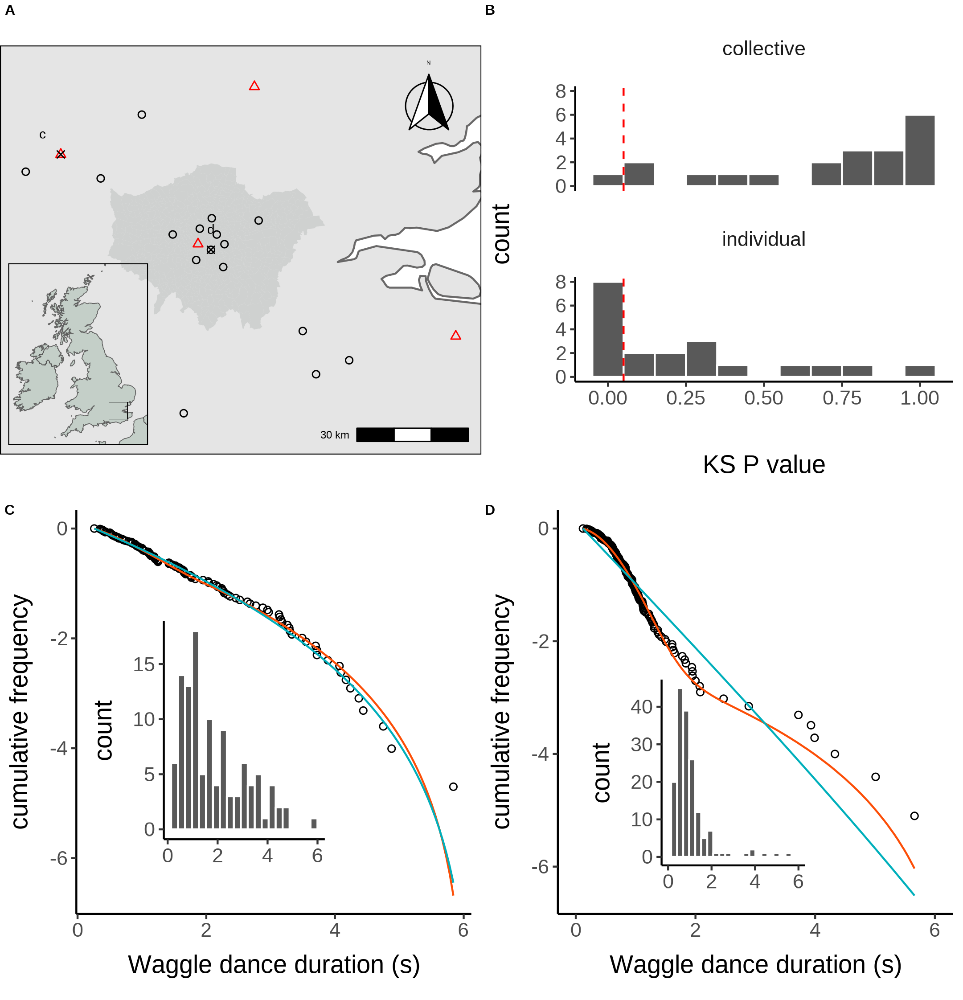

```{r setup, include=FALSE}
knitr::opts_chunk$set(echo = FALSE)
library(showtext)
showtext_auto()

knitr::opts_chunk$set(
  collapse = TRUE,
  comment = "#>",
  fig.path = "man/figures/README-",
  out.width = "100%"
)
library(ggplot2)
theme_set(
  theme_classic() +
    theme(
      text = element_text(size = 18)
    )
)

library(dplyr)
library(kableExtra)
library(flextable)
library(tibble)
```

Alternative title:

- Waggle run durations quantify collective foraging in honey bee colonies
- Waggle run duration distributions quantify collective foraging in honey bee colonies
- Distributions of waggle dance durations quantifies collective foraging in honey bee colonies

Or something like this.

# Abstract

Honeybee foraging is a collective behaviour that is directed through the extraordinary waggle dance communication system, whereby colony foraging effort is allocated through a series of feedback loops [@Frisch1993; @Seeley1995]. Despite having been described as the most astounding example of non-primate communication [@Frisch1993], recent evidence suggests that the benefits of using dance information vary across environments and are sometimes even negligible [@Dornhaus2006; @Price2019]. Yet, because we cannot easily quantify collective foraging, pinpointing which environments promote collective foraging is challenging. Here, we present a mathematical model which quantifies collective foraging by inferring the proportion of 'scout' and 'recruit' dances on a hive's dance floor. By applying this methodology to waggle dance data from twenty hives, we show that dance information may be used less in environments where resources are sparse, potentially because colonies are required to send out more scouts to find food in these circumstances. Our methodology provides a tool to quantify waggle dance use in undisturbed hives at a much larger scale than hitherto has been possible and to identify those ecological conditions that may have driven the evolution of this remarkable collective behaviour.

# Main

Within honeybee colonies, a series of simple rules that determine when and how much bees perform the celebrated waggle dance (Figure of dance waggle dance) mean that choices between feeding sites occur at the level of the group rather than the individual. For example, because the number of dance circuits performed by a bee on returning from a food source reflects the net energetic benefits of the trip, more of the colony's workforce will be recruited to the sweeter of two equidistant sources [@Seeley1991], or the closer of two equally sweet sources [@Hasenjager2022], without requiring any individual bee to compare options. This extraordinary system is a key example of how social insect colony behaviour can take on a form extending beyond that of the individual units [@Sumpter2006].

Despite such impressive complexity, in some situations, colonies that are prevented from communicating via dances achieve equal or even greater foraging success than their wild-type counterparts [@Sherman2002; @Dornhaus2006; @Gruter2013; @Price2019]. This indicates that using the dance does not always provide a foraging advantage and suggests bees may ignore spatial information in dances in favour of independent foraging. The prevalent explanation for this apparent redundancy portrays dance-based collective foraging as an evolutionary anachronism that was useful in ancient tropical environments but offers little benefit in modern temperate environments [@Dornhaus2004; @Donaldson-Matasci2012; @Price2015].

Given that dancing comes at a significant time cost [@Seeley1988], this raises the issue of why all temperate *Apis mellifera* colonies continue to dance. The dual questions of what foraging selection pressures drove the evolution of this uniquely complex collective behaviour, and why it continues to exist, are thus yet to be satisfactorily answered. Empirical studies have shown that honeybee colonies use dance information flexibly in response to their environment [@Sherman2002; @Dornhaus2004; @Dornhaus2006], suggesting that bees cease to rely on dance information if it provides little benefit [@Price2019]. Identifying those environments whereby modern honeybee colonies forage collectively rather than through individual search is a key step towards understanding dance evolution [@Price2015].


**Box 1**

[figure of waggle dance, maybe have text in like a box or something? Or just the text]

Honeybees provide an ideal study system in which to evaluate collective foraging thanks to the famous “waggle dance”, which conveys information about location of a resource as a vector of distance (duration of the waggle run) and direction (angle of the dance relative to the sun) [@Frisch1993].Through the observation and decoding of the waggle dance, a colony's dance floor provides a unique opportunity to eavesdrop on the communication and decision making leading to collective foraging decisions. Resource “quality” is provided through the number of waggle runs performed [@Frisch1993; @Boch1956; @Esch1961; @Seeley1994; @Seeley2000]). Although bees that follow dances do not specifically interpret this information on an individual level [@Seeley1991], the resulting over-representation of high-quality sites on the dance-floor means that they are more likely to encounter dances that advertise better forage [@Seeley1995], and provides the colony with a mechanism to select the most profitable resources in their environment [@Seeley1994A].

**End Box 1**

Overall, evidence that colony-level collective foraging offers any benefit over individual search has proved surprisingly hard to come by. Whilst it is entirely possible the dance no longer provides a benefit in the modern world, a key barrier to assessing waggle dance use is that this requires distinguishing between foraging trips made by
scouting and recruited individuals. Scout foraging trips occur when a food source is located through individual search behaviour, whilst recruit foraging trips occur when a forage site is found by using the information provided in the dance of another bee [@Seeley1995]. Scouting and recruiting are not fixed behavioural categories, because individual bees can engage in both over the course of their foraging lifetime, and foragers can dance on return from any successful trip irrespective of whether they were recruited to the forage site or found it individually [@Beekman2007]. So far, scouts and recruits are distinguished by means of the foragers' individual search history, which requires following individual bees and is time and labour intensive [@Seeley1995].

Here, we will use a different approach and develop a model that describes the proportion of foraging trips in which bees act as scouts, and as recruits, within a colony, based on the distribution of foraging distances reported by waggle dancing, encoded as the duration of the run phase of the dance [@Frisch1993]. We will use this model to infer the proportion of scouts and recruits on the dance floor from dance data, and to demonstrate the principle, apply this methodology to dance data from a collection of hives in different environments.

To reveal how the patterns of waggle dance encoded foraging distances might differ under a scout and recruit foraging strategy, we simulated honeybees foraging in a landscape where resource patches were randomly placed in the environment. Foragers could locate these under two different strategies: either acting as a scout and locating resources themselves, or following a recruit strategy and locating resources by following a random dance from the dance floor [@Seeley1992] (Fig. 1). As it is known in the simulation which individuals forage under what strategy, we can compare the distributions of foraging distances reported on the dance floor. Figs 1c and 1d show that the shapes of the resource distance distributions for the two types of foraging trips are very different. The distance distribution of the scouts is akin to that of an exponential distribution (Fig. 1 C), which is the nearest neighbour distance distribution for foragers operating in a one-dimensional environment (see methods). The distribution of the distances reported by recruits (Fig. 1 D) is a Rayleigh distribution which is the nearest-neighbour distribution of a two-dimensional environment [@Pyke1978] (see Methods).

```{r, fig.cap="Figure 1. A. Outline of individual foraging. Foragers leave the hive on a random flight path (white lines) and continue until they encounter a resource (flowers in the figure). B. Outline of foraging with recruitment. Some foragers (scouts) continue to identify resources but others (recruits) sample available dances provided by scouts and other recruits. C. Log inverse frequency distribution of foraging distances reported by scouts. D. Log inverse frequency distribution of foraging distances reported by recruits."}
knitr::include_graphics("../results/figures/simulation.png")
```

Scouts and recruits create different foraging distance distributions on the dance-floor. These different distance distributions can be used to quantify the relative importance of collective foraging. Scouting foragers report a distribution of distances that reflects their probability of encountering a resource in the environment (see methods), whilst foragers that recruits report distances that reflect the distribution of the most profitable resource available (see methods). On the dance-floor, the distribution of distances is modified through the number of runs performed for a resource, which depends on the profitability of a resource, which honeybees achieve by measuring the energetic efficiency of a foraging trip through the ratio of energetic gain to energetic cost [@Seeley1994A]. By combining this profitability with the distributions identified in our simulations, we develop a novel method to describe the distribution of waggle runs reported on the dance-floors of real honeybee colonies as a superposition of scout and recruit distributions (Fig 2, see Methods).

This method intrinsically captures honeybee foraging as collective decision making, as the foraging sites represented on the dance floor derive from a mixture of individual search and waggle dance information, captured in the proportions $p$ and $1-p$, respectively. Consequently, by setting $p = 1$, we can also derive a model based on the sole use of individual search (scouts only) (Fig 2). By fitting these two models to distribution of waggle run durations decoded from real honeybee colonies we are thus able, using model selection [@Burnham2002], to infer if and, by estimating the parameter $p$, to what extent honeybee colonies use waggle dance information when foraging.

```{r, fig.cap="Figure 2: Model of honey bee foraging. Flowers advertised by scouts are distributed exponentially (a). These dances are advertised on the dance floor (b) in relation to their profitability, meaning sampling recruits are biased to the more profitable (and closer) resources (c). After visiting advertised resources, recruits also dance for them leading to higher recruitment (d) which overall skews the distribution of distances reported on the entire dance floor (e)."}
knitr::include_graphics("../results/figures/foraging-model.png")
```

To evaluate the use of waggle dance information and individual search in honeybee colonies foraging in 'natural' landscapes, we analysed an existing dataset of 3378 waggle dance observations from 20 observation hives, recorded between April-September 2017, (previously described in [@Samuelson2021]). Hives were situated at different locations in South East England (see methods, figure 3A) and were visited every two weeks for a period of 24 weeks. On each visit, two hours of continuous waggle dance data was recorded by training a camcorder onto the dance floor. The footage of the dances was decoded manually ([@Couvillon2012; @Schurch2019] to extract waggle run durations. For each site we fit both the collective and individual models and used model selection to determine which provided the better explanation of the data, and (if the collective model provided a better fit) to quantify the relative use of social information through estimating the parameter p. We calculated the goodness-of-fit using a Kolmorgorov-Smirnov (KS) test to ascertain if the model provided a plausible explanation of the data [@Goldstein2004].

For 17 out of 20 study hives, a model of collective foraging provided a better explanation of the data than one of individual foraging (Fig. 3a). In all but one of these cases, the collective model had a good fit (using a Kolmogorov-Smirnov statistic, see methods) to the empirical waggle run durations, whereas for 9 of these sites, the distribution predicted by the scout model was significantly different to the observed data (Fig. 3b). The sites shown in Figs 3c-d are representative examples showing the model fits, showing the overall quality of the model fit to the data.

```{r, fig.cap="Figure 3. A. Location of study hives in Southern England coloured by which model, collective (black circles) or individual (red triangles) provided the best explanation of the data as indicated by lowest AIC score. Sites STU and ZSL (C & D) are marked. Inset plot shows the location of the sites within the UK. B. Distribution of goodness of fit confidence values for each model fit to waggle run durations from each site. P value is derived from a bootstrapped two-sided KS test comparing the fitted model predictions to the empirical data. The red dashed line marks the significance threshold of 0.05. Values greater than 0.05 indicate no statistically significant difference is observed between the model and the data, indicating the model provides a good fit to the data. C. Model fits to waggle run durations collected from the ZSL hive along with histogram showing distribution. D. Model fits to waggle run durations collected from the STU hive along with histogram showing distribution. Model fits show the compliment cumulative frequency distribution, giving the probability of sampling a value greater than or equal to x."}

```

Our results show that, whilst colony-level foraging is mostly comprised of a mixture of scout and recruit foraging trips, in some circumstances, colony foraging can be better described by individual foraging alone. This suggests that in some environments honey bees engage in scouting to find new food sites rather than follow dances. Previous empirical studies have shown that individual foragers flexibly alter their use of waggle dance information in response to unrewarding resources [@Gruter2011; @Price2019]. Evaluating how these individual decisions influence the collective, however, has historically been a challenge as it is effectively impossible to track an individuals foraging behaviour over a landscape. As our results show that individual foraging accurately describes colony foraging in three different sites, these findings support the idea that individual decision making can dominate colony foraging and demonstrates further evidence for flexible waggle dance use by honey bee colonies.

Our finding that foraging in some landscapes is more accurately described by scouting supports the hypothesis that the dance is used flexibly in response to environmental factors. As the collective model quantifies the contribution of recruitment to colony foraging, the fit of our model provides a new tool to evaluate how environmental factors influence waggle dance use, and thus how a colony uses waggle dance information under different environmental circumstances.

We estimated the proportion of scout and recruit foraging trips for each individual colony and investigated whether these estimates might correlate with land-use. Each site used in this study is situated in a landscape comprised of different proportions of land-use types. To evaluate how these different land-use types influenced waggle dance use, we first classified the different land-use types of the area surrounding each site to obtain a standardised land-use profile for the urban and agri-rural environments separately as many land-use types present in urban areas do not occur in agri-rural environments and vice versa (see methods). As many of the resulting land-use types covaried with each other, we performed a Partial Least Squares (PLS) analysis [@Carrascal2009] (see methods) to determine the principal components that represent combinations of land-use types which explained the most variation in the proportion of scout dances within agri-rural and urban environments. As we have a small sample size, this analysis was jackknifed to evaluate the robustness of our results to influential points (see methods, supplementary material section _._)

In the agri-rural environment one combination of land use types explained ~52% of the variation in the proportion of scouts (beta regression: $R^2 = 0.52$, $\phi$ = 3.7, p < 0.05, Fig. 4. A). This principal component correlates positively with arable land and negatively with non-agricultural unmanaged green space, built-up areas and water (Fig. 4. B). These land-use types maintain a significant correlation with PC1 over the jackknifed PLS (Fig. 4. B) indicating the results are robust. As arable land increases whilst unmanaged green space and built-up areas decrease, the proportion of individuals prioritising private information increases. Arable land dominates the agri-rural environment accounting for over 28% of land-coverage, whilst built-up areas represent around 17% of lands (Table 1). Non-agricultural unmanaged green space represent smaller amounts of land, accounting for less than 3% of the total land combined (Table 1).

```{r, agri-rural-area-table}
set_flextable_defaults(
  big.mark = " ",
  font.size = 10, theme_fun = theme_vanilla,
  padding.bottom = 6,
  padding.top = 6,
  padding.left = 6,
  padding.right = 6
)

load("../results/area_coverage.RData")

rural_total_area %>%
  arrange(desc(`% coverage`)) %>%
  mutate(`% coverage` = signif(`% coverage`, 3)) %>%
  flextable() %>%
  set_caption(
    "Percentage area covered for each land-use type in the agri-rural environment"
  ) %>%
  set_table_properties(layout = "autofit")
```

```{r, fig.cap="Figure 4. A. Estimated proportion of scouts for each site in the Agri-rural landscape against the first principle component derived from a Partial Least Squares analysis of land-use type. A beta regression shows the relationship (black line) between PC1 and the proportion of scouts, with 95% CI shown by the blue shaded area. B. Loadings for PC1 showing the correlations between PC1 and each land-use type (NAUMGS stands for Non-agricultural unmanaged green space). All points outside the shaded area significantly contribute to PC1. The colours of these land-use types are shown in the local environment of sites MEL, ROT and BEL (maps in bottom left) chosen as representative sites along the model gradient."}
knitr::include_graphics("../results/figures/lu_prop_scouts_agrirural.png")
```

A similar effect is also observed in the urban environment, where a single PC explained ~59% of the variance in the proportion of scouts (beta regression: $R^2$ = 0.59, $\phi$ = 6.2, p < 0.05, Fig. 5. A). This PC correlates positively with parks, allotments and cemeteries, whilst correlating negatively with sparse residential lands and railways (Fig. 5. B). However, the jackknifed PLS identifies CAD as a highly influential site, the removal of which causes sparse residential land to have a positive correlation with PC1 (Supplementary Material _._). Visualising how waggle dance use is influenced by changes in these land-use types shows that when the landscape is dominated by sparse residential land, as in site HHS, waggle dance use dominates the colonies foraging strategy. However, this reduces as sparse residential land is replaced by parks, allotments, and cemeteries (Fig. 5). Sparse residential land dominates the urban environment accounting for over 34% of land-coverage, whilst parks allotments and cemeteries and railway corresponds to ~8% and ~1 respectively (Table 2).

```{r, urban-area-table}
urban_total_area %>%
  arrange(desc(`% coverage`)) %>%
  mutate(`% coverage` = signif(`% coverage`, 3)) %>%
  flextable() %>%
  set_caption(
    "Percentage area covered for each land-use type in the agri-rural environment"
  ) %>%
  set_table_properties(layout = "autofit")
```

```{r, fig.cap="Figure 5. A. Estimated proportion of scouts for each site in the urban landscape against the first principle component derived from a Partial Least Squares analysis of land-use type. A beta regression shows the relationship (black line) between PC1 and the proportion of scouts, with 95% CI shown by the blue shaded area. B. Loadings for PC1 showing the correlations between PC1 and each land-use type. All points outside the shaded area significantly contribute to PC1. The colours of these land-use types are shown in the local environment of sites HHS, MPA and CAD (maps in bottom left) chosen as representative sites along the model gradient."}
knitr::include_graphics("../results/figures/lu_prop_scouts_urban.png")
```

In agri-rural environments, land-use types which typically associate with resource scarcity correlate positively with a higher proportion of scouts, whilst those which correlate with a higher resource abundance correlate with a lower proportion of scouts. Arable land is typically nutritionally poor for honey bees [@Samuelson2021]. On the contrary, built up areas often have gardens with ample flowers available for pollinators [@Baldock2019]. Although non-agricultural unmanaged green space and water show as significantly correlating with reduced use of the dance, as they cover such a small amount of area, combined with a small sample size of only 10 sites, we cannot ignore the possibility that their significance is a random effect rather than evidence of a biological mechanism. Overall, these findings indicate that in agri-rural environments, when resources are more abundant and thus easier to find, the waggle dance is used more, presumably to identify the best resources of those on offer. Conversely, where resources are sparse and more difficult to find, a decreased use of the waggle dance suggests the colony focuses more on individual exploration rather than in trying to locate the best resources.

A similar result is observed in urban sites, where the presence of flower rich gardens in residential areas appears to promote increased use of the dance. Conversely, an increase in the amount of parks, allotments and cemeteries appears to decrease the use of the dance. Such land-use types could be expected to be quite resource rich for pollinators yet our findings suggests honey bee colonies decrease the use of the dance in such environments. It is possible that such environments vary seasonally in terms of their forage availability, allowing them to function both as floral deserts and oasis at different times of the year. As our waggle dance observations were collected over the course of an entire season, we may only be picking up the dominant signal over this time frame. However, the jackknife analysis shows our results are highly sensitive to influential points. Further data is therefore needed to investigate how the urban environment influences waggle dance use in honey bees.

The fitting of our model to waggle dance observations provides a novel tool to quantify the relative importance of social and private information in honeybees. Further, by identifying the land-use combinations which most influence variation in the proportion of scouts, our analysis allows us to map the environment along the major axis of honeybee information use and visualise how land-use influences the use of the waggle dance. Our results within the agri-rural sites are in broad agreement with other studies which evaluated foraging performance with and without the dance [@Dornhaus2006; Price2019]. These results suggest that, even though collective foraging is not always beneficial, that in environments where high quality resources are present, but relatively scarce, collective foraging is being carried out by colonies, suggesting that under these conditions exchanging social information through the waggle dance confers benefits. These benefits of dancing appear to outweigh the costs associated with dancing and could explain why this remarkable behaviour is present in modern-day bees. However, the results for our urban sites do not produce a clear biological rational and present an all together more varied picture. More waggle dance data from urban colonies is therefore required to further probe how honeybees use the waggle dance in this heavily anthropogenic environment.

The analysis of waggle dance data can make an important contribution to our understanding of social information use and provides a methodology to further evaluate how honey bees use their unique dance language. Recently, technological advances have emerged which enable colony metrics to be collected faster, more accurately and over greater time spans than could be gathered by hand, allowing individuals to be tracked within colonies and theories of individual behaviour to be evaluated in more depth than could have been done previously [@Wild2021]. By piecing together the behavioural response of individuals and combining these with landscape analyses, we have found a mathematical description of colony foraging which extends our ability to predict individual behaviour beyond the colony walls and in to the environment. With the advances in the decoding of the waggle dance through automated methods [@Wario2017], we face the prospect of waggle dance data becoming “big data”. Our methodology thus provides a means of analysing such large data sets to inform the debate about the importance of social information, as well as providing useful colony metrics of foraging activity.

# References
