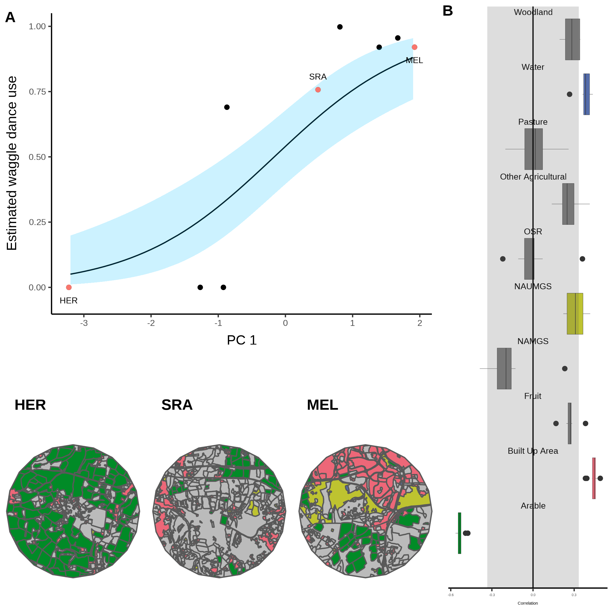
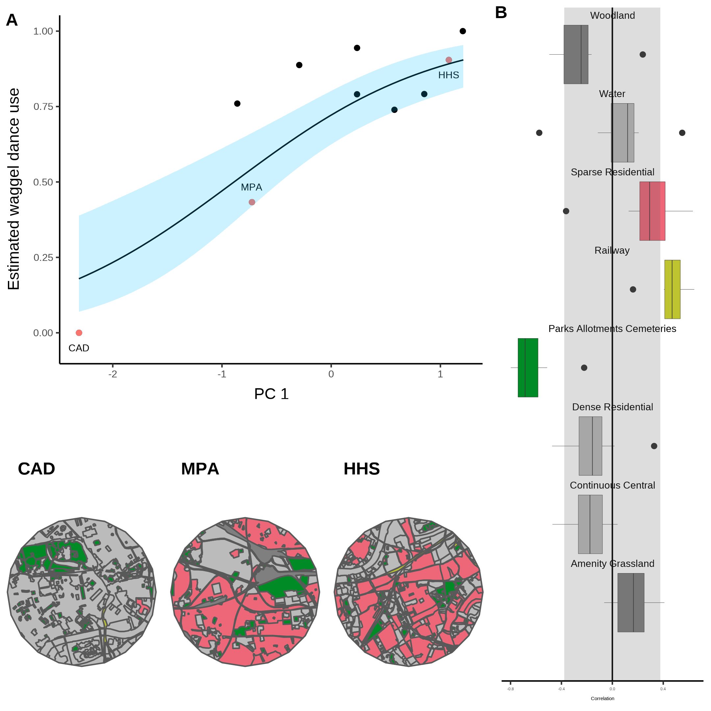

```{r setup, include=FALSE}
knitr::opts_chunk$set(echo = FALSE)
library(showtext)
showtext_auto()

knitr::opts_chunk$set(
  collapse = TRUE,
  comment = "#>",
  fig.path = "man/figures/README-",
  out.width = "100%"
)
library(ggplot2)
theme_set(
  theme_classic() +
    theme(
      text = element_text(size = 18)
    )
)

library(dplyr)
library(kableExtra)
library(flextable)
library(tibble)
```

# Abstract

Environmental conditions are widely understood to influence the value of social and private information when foraging. Exploring this relationship in detail requires quantifying the extent to which foraging decisions are made using social or private information. In honeybees, foragers use the waggle dance to organise collective foraging, yet under some conditions it’s use is less effective than prioritising private information. Identifying how information is used at a collective level is challenging due to the difficulty in evaluating individual behaviours on the colony scale. Here, we outline a model to quantify the extent to which honeybees use the waggle dance by evaluating the foraging distance distributions reported on the dance floor. In confronting this model with waggle dance data from twenty hives, we demonstrate that waggle dance use depends on the local environment of a hive. Further, by combining our estimates of waggle dance use with local landscape characteristics, our methods demonstrate a means of visualising the relationship between major landscape type and waggle dance use. These methods offer a novel approach to evaluate what factors likely led to the evolution of this unique behaviour, as well as helping determine how honeybees might adapt to an increasingly anthropogenic world.

# Main

Decision making by social insects typically requires the use of both social and private information (ref). However, to what degree social or private information is needed depends on circumstance (ref), and the mixture of private and social information varies both spatially and temporally. Although collective decision making using social information is an adaption to foraging in challenging environments (ref), in some cases, groups have been shown to do better when individuals prioritise information obtained through their own experiences to that provided by conspecifics [@King2007; @Rieucau2011; @Gruter2013]. Identifying the conditions which favour the use of these two types of information is important to understand how social insects make collective decisions, and determining what conditions might have led to the evolution of sociality as well as how social insects might respond to anthropogenic changes.

Honeybees provide an ideal study system in which to evaluate social information use thanks to the famous "waggle dance", which conveys the location of a profitable resource as a vector of distance (duration of the waggle run) and direction (angle of the dance) [@Frisch1993]. Resource “quality” is not encoded in the form of the dance itself, but in the number of waggle runs performed [@Frisch1993; @Boch1956; @Esch1961; @Seeley1994; @Seeley2000]. Although bees that follow dances do not specifically interpret this information on an individual level [@Hasenjager2021], the resulting over-representation of high-quality sites on the dance-floor means that they are more likely to encounter dances that advertise better forage [@Seeley1995]. This creates a feedback mechanism through which the hive processes the information collected and proportionally selects the most profitable resources [@Seeley1994A].

Despite the efficiency benefits the waggle dance reportedly provides, its contribution to colony foraging success remains unclear. In many situations, colonies that are prevented from communicating via dance behaviour achieve equal or even greater foraging success than their wild-type counterparts [@Sherman2002; @Dornhaus2004; @Price2019]. In some ecological circumstances, individuals that forgo waiting for dance information in favour of individual search, termed “scouting”, may find food more quickly, and evidence suggests that bees adopt this strategy if the benefits of dance-following drop [@Gruter2008]. Whilst individuals can be observed under experimental conditions to determine how they use different sources of information, translating this up to a colony level is challenging due to honeybees small size, extensive foraging ranges and shear number of foragers. New methods which can quantify waggle dance use at a colony level are therefore needed if we are to assess the conditions where the dance provides the most benefit and derive the conditions user which this unique behaviour evolved.

Whether an individual forager uses social information and follows a waggle dance from the dance floor or acquires private information through scouting, all foragers report resource information on the dance-floor [@Seeley1995]. Consequently, the difference in foraging behaviours between recruited individuals following dances and scouting individuals relying on private information should manifest itself in the pattern of dances reported on the dance-floor. Here, we will demonstrate that in honeybees it is possible quantify the use of social and private information through the observation of honeybees’ waggle dances.

To reveal what foraging patterns might look like under a social or personal information use strategy, we simulated honeybees foraging in a landscape using both personal and waggle dance information (Fig. 1). As it is known in the simulation which individuals forage under what strategy, we can compare the distributions of foraging distances reported on the dance floor. Figs 1c and 1d show that the shapes of the resource distance distributions under the two simulated scenarios are very different. The distribution of the first simulation is akin to that of an exponential distribution (Fig. 1 C), which is the nearest neighbour distance distribution for foragers operating in a one-dimensional environment (see methods). The distribution of the distances reported by recruits (Fig. 1 D) appears to be a Rayleigh distribution which is the nearest neighbour distribution of a two-dimensional environment (see methods).

```{r, fig.cap="Figure 1. A. Outline of individual foraging. Foragers leave the hive on a random flight path (white lines) and continue until they encounter a resource (flowers in the figure). B. Outline of foraging with recruitment. Some foragers (scouts) continue to identify resources but others (recruits) sample available dances provided by scouts and other recruits. C. Log inverse frequency distribution of foraging distances reported by scouts. D. Log inverse frequency distribution of foraging distances reported by recruits."}
knitr::include_graphics("../results/figures/simulation.png")
```

Scouts and recruits report different foraging distance distributions on the dance-floor. This means the distances reported on the dance floor can be used to quantify the relative use of private and social information. Foragers that use private information (scouts) report a distribution of distances that reflects their probability of encountering a resource in the environment (see methods), whilst foragers that use social information (recruits) report distances that reflect the distribution of the most profitable resource available (see methods). The distance distribution reported on the dance floor therefore carries information about the extent to which private and social information is used.

On the dance-floor, the distribution of distances is modified through the profitability of a resource reported. Honey bees achieve this by measuring the energetic efficiency of a foraging trip through the ratio of energetic gain to energetic cost [@Seeley1994A]. Combined with the distance distributions identified in our simulations, we can describe the distances reported on the dance-floor as a superposition of private and social information use (Fig 2, see Methods). We assume that scouts report distances as they encounter resources on their scouting forays. If resources are distributed randomly this is approximated by an exponential distribution. Recruits report the most profitable resource among the resources advertised on the dance floor and follow a Rayleigh distribution (see Methods).

This yields two models for foraging: one model based on collective decision making which uses a mixture of private and social information, comprised of the proportion of dances following an individual foraging strategy (scouts), denoted by the parameter $p$, along with the proportion of dances, $1-p$, following a waggle dance use strategy (recruit), and a model based on the sole use of private information (scouts only, $p = 1$) (Fig 2). By using maximum likelihood methods and model selection, we inferred if and, by estimating the parameter $p$, to what extent colonies use social information.

```{r, fig.cap="Figure 2: Model of honey bee foraging. Flowers advertised by scouts are distributed exponentially (a). These dances are advertised on the dance floor (b) in relation to their profitability, meaning sampling recruits are biased to the more profitable (and closer) resources (c). After visiting advertised resources, recruits also dance for them leading to higher recruitment (d) which overall skews the distribution of distances reported on the entire dance floor (e)."}
knitr::include_graphics("../results/figures/foraging-model.png")
```

To evaluate collective decision making in honey bee colonies foraging on 'natural' landscapes we analysed a dataset of 3378 waggle dance observations from 20 observation hives between April-September 2017, previously described in [@Samuelson2021]. Hives were situated at different locations in South East England (see methods, figure 3A) and were visited every two weeks for a period of 24 weeks. On each visit, two hours of continuous waggle dance data were recorded by training a camcorder onto the dance floor. The footage of the dances was decoded manually to identify reported foraging locations [@Couvillon2012; @Schurch2019]. For each site we fit both the collective and individual foraging models. We used model selection to determine which model provided the better explanation of the data, and quantify the relative use of social information through estimating the parameter $p$. We calculated goodness-of-fit using a Kolmorgorov-Smirnov (KS) test to ascertain if the model provided a plausible explanation of the data.

For 17 out of 20 study hives, a model of collective foraging provided a better explanation of the data than one of individual foraging (Fig. 3a), in 3 sites the individual model provided the best explanation of foraging patterns. Across 17 of the sites, the collective model had a good fit to the empirical foraging distances, whereas the scout model was significantly different to the data in 8 of the sites, and therefore not deemed a plausible model (Fig. 3.b). The sites shown in Figs  3c-d are representative examples showing the model fits. For the data in Fig 3c the collective model describes foraging distances extremely well and no significant difference is observed between the model and empirical foraging distances (AIC: 569, Bootstrapped KS statistic: d = 0.06, p = 0.395). In contrast the scout model and empirical foraging distances are significantly different, providing a worse explanation of the data (AIC: 622, KS statistic: d = 0.122, p < 0.01). For Fig 3d the collective model provides a slightly better fit (KS: d = 0.04, p = 0.999) than the scout model (KS: d = 0.05, p = 0.998), however, the scout model is more parsimonious (AIC: 388) than the collective model (AIC: 393).

```{r, fig.cap="Figure 3. A. Location of study hives in Southern England coloured by which model, collective (black circles) or individual (red triangles) provided the best explanation of the data as indicated by lowest AIC score. Sites STU and ZSL (C & D) are marked. Inset plot shows the location of the sites within the UK. B. Distribution of goodness of fit confidence values for each model fit to waggle dance derived foraging distances from each site. P value is derived from a bootstrapped two-sided KS test comparing the fitted model predictions to the empirical data. The red dashed line marks the significance threshold of 0.05. Values greater than 0.05 indicate no statistically significant difference is observed between the model and the data, indicating the model provides a good fit to the data. C. Model fits to waggle dance derived foraging distances collected from the ZSL hive along with histogram showing distribution. D. Model fits to waggle dance derived foraging distances collected from the STU hive along with histogram showing distribution. Model fits show the compliment cumulative frequency distribution, giving the probability of sampling a value greater than or equal to x."}
knitr::include_graphics("../results/figures/sites_model_plot.png")
```

Our results show that, whilst foraging decisions are primarily reached using social and private information, in some circumstances, colony foraging is best explained by a model of individual foraging and private information use. This suggests that in some environments, honeybees actively ignore the waggle dance and instead prioritise the use of private information. Previous empirical studies have shown that individual foragers flexibly alter their use of waggle dance information in response to unrewarding feeders [@Gruter2011], suggesting experience drives information use at the individual level. Evaluating how these individual decisions influence the collective, however, has historically been a challenge as it is effectively impossible to track an individuals foraging behaviour over a landscape.

As well as providing direct evidence that honey bees forage collectively according to a widely accepted theory [@Seeley1994; @Sherman2002], in showing that foraging patterns in three of our sites are best explained by individual foraging, our results demonstrate honey bee colonies tune waggle dance use in relation to environmental factors.

Using the $p$ parameter estimated from our model fits, we evaluated how the use of social information varies across different environments. Each site used in this study has a unique landscape comprised of different proportions of common land-use types. We first classified the different land-use types of the area surrounding each site to obtain a standardised land-use profile for the urban and agri-rural environments separately. As many of the resulting land-use types covaried with each other, we performed a Partial Least Squares (PLS) analysis to determine the combination of land-use types which explained the most variation in the proportion of scout dances.

In the Agri-rural environment a single PC explained ~60% of the variation in the proportion of scouts (beta regression: $R^2$ = 0.6, $\phi$ = 4.9, p < 0.05, Fig. 4. A). This PC correlates positively with arable land and negatively with non-agricultural unmanaged green space (NAUMGS), built-up areas and water (Fig. 4. B). This analysis allows us to visualise what aspects of a colonies local environment most influence waggle dance use. As arable land increases whilst NAUMGS and built-up areas decrease, the proportion of individuals prioritising private information increases.

```{r, fig.cap="Figure 4. A. Estimated proportion of scouts for each site in the Agri-rural landscape against the first principle component derived from a Partial Least Squares analysis of land-use type. A beta regression shows the relationship (black line) between PC1 and the proportion of scouts, with 95% CI shown by the blue shaded area. B. Loadings for PC1 showing the correlations between PC1 and each land-use type (note NAUMGS stands for Non-agricultural unmanaged green space). All points outside the shaded area significantly contribute to PC1. The colours of these land-use types are shown in the local environment of sites HOR, SWP and CAD (maps in bottom left) chosen as representative sites along the model gradient."}

```

A similar effect is also observed in the urban environment, where a single PC explained ~61% of the variance in the proportion of scouts (beta regression: $R^2$ = 0.61, $\phi$ = 7.4, p < 0.05, Fig. 5. A). This PC correlates positively with continuous central land, dense residential land and water, whilst correlating negatively with sparse residential and amenity grassland (Fig. 5. B). This relationship appears to be largely driven by a single site showing a model of only individual foraging as the best fit. Visualising how waggle dance use is influenced by changes in these land-use types shows that when the landscape is dominated by sparse residential land, as in site HOR, waggle dance use dominates the colonies foraging strategy. However, this reduces as sparse residential land is replaced by continuous central and dense residential lands (Fig. 5)

```{r, fig.cap="Figure 4. A. Estimated proportion of scouts for each site in the urban landscape against the first principle component derived from a Partial Least Squares analysis of land-use type. A beta regression shows the relationship (black line) between PC1 and the proportion of scouts, with 95% CI shown by the blue shaded area. B. Loadings for PC1 showing the correlations between PC1 and each land-use type. All points outside the shaded area significantly contribute to PC1. The colours of these land-use types are shown in the local environment of sites MEL, SOM and BEL (maps in bottom left) chosen as representative sites along the model gradient."}

```

The fitting of our model to waggle dance observations provides an innovative new tool to quantify the relative importance of social and private information in honeybees. Further, by identifying the land-use combinations which most influence variation in the proportion of scouts, our analysis allows us to map the environment along the major axis of honeybee information use and visualise how land-use influences the use of the waggle dance. Despite being limited to 10 sites in an urban and agri-rural environment, our results appear to agree with previous findings that the environment influences waggle dance use [@Dornhaus2006; @Price2019].

In both the agri-rural and Urban environments, land-use types which associate with resource scarcity correlate positively with a higher proportion of scouts, whilst those which correlate with resource abundance correlate with a lower proportion of scouts, indicating a greater use of the waggle dance. Arable land is typically nutritionally poor for honey bees (ref). On the contrary, non-agricultural unmanaged green space is typically nutrient rich, as are built up areas in agri-rural environments, which often have gardens with ample flowers available for pollinators (ref). The same can also be said of the urban land-use types, where continuos central and dense residential areas are also nutritionally poor (ref) compared to sparse residential and amenity grasslands. In both landscapes, water shows as significant contributor but in opposite directions, increasing waggle dance use in the agri-rural environment whilst decreasing it in the urban. This might indicate that agri-rural water ways provide good floral resources for honeybees, whereas urban water ways do not. However, the map visualisations suggests that these land-use types offer little contribution to the overall environment. More data is therefore required to evaluate this relationship further.

Overall, we have demonstrated here that the analysis of waggle dance data can make an important contribution to our understanding of social information use and provides a methodology to further evaluate how honey bees use the unique waggle dance. Recently, technological advances have emerged which enable colony metrics to be collected faster, more accurately and over greater time spans than could be gathered by hand, allowing individuals to be tracked within colonies and theories of individual behaviour to be evaluated in more depth than could have been done previously [@Wild2021]. We are not yet in a position to be able to track behaviours outside the colony in the same detail, nevertheless, by piecing together the behavioural response of individuals into a mathematical description of colony foraging, the methodology outlined here extends our ability to predict individual behaviour beyond the colony walls and in to the environment. With the advances in the decoding of the waggle dance through automated methods [@Wario2017], we face the prospect of waggle dance data becoming “big data”. Our methodology thus provides a means of analysing such large data sets to inform the debate about the importance of social information, as well as providing useful colony metrics of foraging activity.

# References
