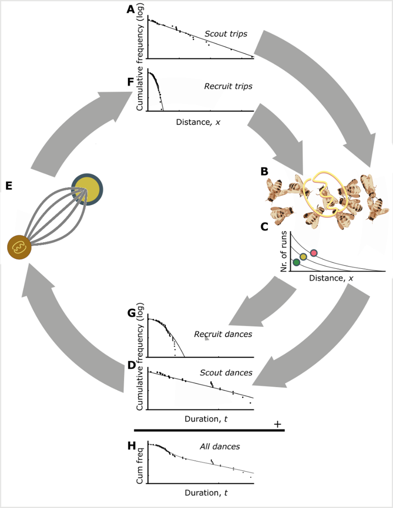

```{r setup, include=FALSE}
knitr::opts_chunk$set(echo = FALSE)
library(showtext)
showtext_auto()

knitr::opts_chunk$set(
  collapse = TRUE,
  comment = "#>",
  fig.path = "man/figures/README-",
  out.width = "100%"
)
library(ggplot2)
theme_set(
  theme_classic() +
    theme(
      text = element_text(size = 18)
    )
)

library(dplyr)
library(kableExtra)
library(flextable)
library(tibble)
```

# Abstract

Honeybee foraging is an extraordinary collective behaviour that is directed by the waggle dance communication system, whereby colony foraging effort is allocated through a series of feedback loops. Here, we present a mathematical framework to quantify how use of the waggle dance shifts in different landscape types. By decoding dances inside hives, we infer the proportion that are performed by bees that forage individually, and those that forage collectively. By applying this methodology to data from twenty hives, we show our model closely fits real-world honeybee foraging patterns and we demonstrate that colonies vary their use of waggle dance information across different landscapes. Our methodology provides a tool to identify the ecological conditions in which honeybee colonies rely on dance communication, opening the door to large-scale experimental exploration of the selection pressures that may have driven the evolution of this remarkable collective behaviour.

# Introduction

In group living animals, many decisions are taken collectively by integrating information from individuals to produce a social behaviour which extends beyond that of the individual units [@Sumpter2006]. Such systems are self-organised, relying on the constituents using socially provided information and following behavioural 'rules' to produce a collective outcome [@Couzin2003;@Bonabeau1997]. However, in addition to information provided by others, individuals also have knowledge of their own (private information) and so can choose to work collectively or individually [@Dall2005;@Reiucau2011;@Gruter2014]. The benefits of working collectively versus independently vary across environmental contexts and individuals often adjust their own use of information accordingly [@Dechaume-Moncharmont2005;@Beekman2008]. The impact these individual variations in information use have at a group level, however, is less well understood and difficult to empirically evaluate [@Rieucau2011;@Giardina2008;@Delgado2018].

Understanding the collective ramifications of individual variation in information use is not only important for deciphering how social animals collectively regulate information use [@Gruter2014], relating this to the environmental context of the behaviour is key to illuminating the ultimate evolutionary drivers of collective processes [@Price2015]. However, establishing the group level effects of individual variation in information use is not trivial and requires measuring information use across animal groups, an often laborious process which requires monitoring individuals' behaviours and interactions. This becomes logistically impossible in very large animal groups, such as in social insects, which display some of the most intricate group decision-making mechanisms and consist of often thousands of individuals, each using a mix of individual and collective information to make decisions [@Bonabeau1997].

Social insects are defined by their highly coordinated collective responses and so provide ideal systems to investigate the impact of individual variation in information use on emergent collective processes. Nevertheless, the sheer quantity of individuals in many colonies is a barrier to further understanding these dynamics. Honey bees (Apis spp.) provide an opportunity to sidestep this problem of scale as they provide a detailed record of colony foraging activity in the form of their unique waggle dance -unparalleled in even a single other social insect [@Seeley1995]. Using the dance, individuals share information about profitable resource locations. A series of simple rules which determine when and how much bees perform waggle dances (Fig. 1) mean that choices between feeding sites occur at the level of the group rather than the individual [@Seeley1991;@Seeley2004;@Hasenjager2022]. Despite this, a wealth of research shows that individual foragers frequently do not use dance information to find forage sites and instead rely on their own knowledge [@Gruter2009]. Moreover, studies investigating the value of the dance have shown that when prevented from communicating via dances, honey bee colonies can achieve equal or even greater foraging success than their wild-type counterparts [@Sherman2002;@Dornhaus2004;@Gruter2013;@Price2019].

```{r, fig.cap="Figure 1. **The honeybee waggle dance carries information about the location of a resource.** The duration of the waggle run indicates the distance to the resource and the angle of the dance relative to the vertical indicates the direction of the resource (circle in right panel), relative to the direction of the sun [@Frisch1993]. Through the observation and decoding of the waggle dance, a colony's dance floor provides a unique opportunity to eavesdrop on the communication and decision making leading to collective foraging decisions. Overall resource “quality” -the net energetic gain of a foraging trip- is provided through the number of waggle runs performed [@Frisch1993;@Boch1956;@Esch1961;@Seeley1994;@Seeley2000]. Although bees that follow dances do not specifically interpret this information on an individual level [@Seeley1991], the resulting over-representation of high-quality sites on the dance-floor means that they are more likely to encounter dances that advertise better forage [@Seeley1995], and provides the colony with a mechanism to select the most profitable resources in their environment [@Seeley1994A]."}
knitr::include_graphics("../results/figures/manuscript_figures/fig1.png")
```

The waggle dance provides a model system to study the group effects of collective and individual information use. Although it is likely that individual variation in dance use translates into variations in collective decision making at the colony level [@Donaldson-Matasci2012;@Price2019], this dynamic has not been empirically established. Individual based models, which explore the collective effects of individuals following different information streams provide an insight into how individual behaviours scale to the level of the group [@Dornhaus2006;Beekman2008], however, these are difficult to empirically relate to real observations and so are limited to showing what a colony under certain conditions might do, rather than quantifying what they are doing. Empirically determining how dance information is used at a colony level requires new methods which can identify the behaviours of individual foragers and integrate them with the mechanisms by which the dance functions to make collective decisions. Previously, this has only been quantifiable by documenting foragers' individual search history, which requires tracking individual bees and is time -and labour- intensive [@Seeley1995].

Here, we investigate how variation in individual information use influences the collective foraging behaviour of honey bees. Using a model based on well-established foraging behaviours [@Seeley1986;@Seeley1991;@Seeley1992;@Seeley1994;@Seeley1994A;@Seeley1995], we examine the distribution of waggle run durations and infer from its shape the relative contribution of dances for resources identified by individual search - “scouting”- versus dances for resources found by following dances - “recruitment”- [@Seeley1995]. This allows us to quantify the extent to which colonies use dance communication and thus forage collectively. To investigate how information use varies across environment, we fit our model to waggle dance observations from 20 sites in an agri-rural and urban environment (10 in each) and evaluated the landscape characteristics which best explained the variance in dance use.


# Results

The patterns of waggle dance-encoded foraging distances might differ under scenarios where colonies rely on individual search versus recruitment. To test this, we simulated honeybees foraging in a landscape where resource patches were randomly placed in the environment. Foragers could locate these under two different strategies: either acting as a scout and locating resources themselves, or following a recruit strategy and locating resources by following a random dance from the dance floor [@Seeley1992] (Fig. 2a,b, details in Materials and Methods). As it is known in the simulation which individuals in the hive forage under what strategy, we can compare the distributions of foraging distances reported on the dance floor by each type of forager. Fig 2c shows that the shapes of the resource distance distributions for bees engaging in the two types of foraging trips are different. The distance distribution for the scout trips is akin close to that of an exponential distribution (Fig. 2c), which is the nearest neighbour distance distribution for foragers operating in a one-dimensional environment (see Materials and Methods). The distribution of the distances reported for recruit trips (Fig. 2c) is a Rayleigh distribution which is the nearest-neighbour distribution in a two-dimensional environment [@Pyke1978] (see Materials and Methods).

```{r, fig.cap="Figure 2. **Simulating honey bee foraging**. In our simulation model with scouting only (a), foragers leave the hive on a search path (white lines) and continue until they encounter a resource (circles, colours indicate different resource quality). When foraging with recruitment (b) foragers continue to identify resources in scouting trips (white lines) and convey this information on the dance floor (brown disc) where foragers can sample dances reporting on scouting and recruiting trips and follow these directions (yellow lines). (c) Complementary cumulative frequencies of foraging distances reported from scouting and recruit trips. Note the difference in the shape of the distributions. The scout distribution is best fit by an exponential (grey fit line), the recruit distribution by a Rayleigh distribution (black line)."}
knitr::include_graphics("../results/figures/manuscript_figures/fig2.png")
```

On the dance-floor, the number of waggle runs performed for a resource depends on its profitability [@Seeley1994]. Honeybees achieve this by measuring the energetic efficiency of a foraging trip through the ratio of energetic gain to energetic cost [@Seeley1994;@Seeley1994A]. By combining this profitability bias with the distributions identified in our simulations, we can accurately describe the distribution of waggle runs reported on the dance-floors of real honeybee colonies as a superposition of scout and recruit distributions (Fig 3, see Materials and Methods for details)

This description intrinsically captures honeybee foraging as collective decision making, whereby the foraging sites represented on the dance floor derive from a mixture of individual search and waggle dance information, modified by the profitability rule that biases recruitment towards closer or richer patches. The extent to which collective decision making is used is expressed in the proportion of scout dances, $p$, and the proportion of recruit dances, $1-p$. Scouting and recruiting are not fixed behavioural categories, because individual bees can engage in both over the course of their foraging lifetime, and foragers can dance on return from any successful trip irrespective of whether they were recruited to the forage site or found it individually [@Beekman2007].

We constructed two models of foraging: an individual model describing a hypothetical colony that relies only on individual search to find foraging sites, and a collective model which describes a colony using waggle dance communication to exploit resources. In the individual model, all trips are "scout" trips, but as recruitment becomes more important, the proportion of “recruit” trips will increase. By setting $p = 1$, we obtain a model based on the sole use of individual search (scouts only) and, alternatively, by allowing the proportion of scout trips, $p$, to take on any value between 0 and 1, we can model the extent to which foraging occurs collectively. (Fig 2). In fitting these two models to distribution of waggle run durations decoded from real honeybee colonies we are thus able, using model selection [@Burnham2002], to infer if and, by estimating the parameter $p$, to what extent honeybee colonies use waggle dance information when foraging.

```{r, fig.cap="Figure 3. **The rationale of the foraging model**. The distances of resources encountered by scouts are distributed exponentially (a). These dances are advertised on the dance floor (b). Dances for resources that are closer or higher in quality are repeated more often (c). As a consequence, dances for more profitable resource are over-represented and sampling foragers are biased to the more profitable resources (d). After successfully visiting advertised resources, recruits also dance for them leading to further amplification of this bias towards the most profitable resource in the vicinity of the hive (e).  The distances of recruiting trips are than distributed through a Rayleigh distribution (f). The distances reported on the dance floor are a mixture of the scout and recruiting trips and can be calculated from the distance distributions of the scouting and recruiting trips, taking the reporting bias into account (see Materials and Methods for detail)."}

```

To evaluate the use of waggle dance information and individual search in honeybee colonies foraging in 'natural' landscapes, we analysed a pre-existing dataset of 2827 waggle dance observations from 20 observation hives, recorded between April-September 2017, (previously described in [@Samuelson2021]). Hives that contributed to this dataset had been situated at different locations in South East England (see Materials and Methods, figure 4A) and visited every two weeks for a period of 24 weeks. On each visit, two hours of continuous waggle dance data was recorded by training a camcorder onto the dance floor. The footage of the dances was decoded manually [@Couvillon2012;@Schurch2019;@Samuelson2021] to extract waggle run durations. Using this data, for each site we fit both the collective and individual models and used model selection to determine which provided the better explanation of the data, and (if the collective model provided a better fit) to quantify the relative use of social information through estimating the parameter $p$. In each case, We calculated the goodness-of-fit using a Kolmorgorov-Smirnov (KS) test to ascertain if the model provided a plausible explanation of the data [@Goldstein2004;@Clauset2009].

For 16 out of 20 study hives, the collective model provided a better description of the data than the individual model (Fig. 4a). In the other 4 sites, despite the collective model having the higher maximum likelihood, the individual model had a higher AIC value and so is more parsimonious (Supplementary Table 1). In all but one site, the collective model had a good fit (using a Kolmogorov-Smirnov statistic of $p > 0.05$, see Materials and Methods) to the empirical waggle run durations (Fig. 4b), whereas the individual model was significantly different to the observed data in 8 sites (Kolmogorov-Smirnov statistic $p < 0.05$, Fig. 4b). The sites shown in Figs 4c-d are representative examples showing the model fits where the individual (Fig. 4c) and collective (Fig. 4d) models fit best. Note the closeness of the fit to the data, illustrating the overall quality of the model description.

```{r, fig.cap="Figure 4. **The honey bee foraging model fitted to data from 20 hives**.  (a) Location of study hives in Southern England, shaded area in the main plot indicates Greater London. For 16 hives for the collective foraging model provided best explanation (black circles) or for 4 hives the individual search model provided the best explanation(red triangles) as indicated by lowest AIC score. (b). Distribution of goodness of fit confidence values for each model fit to waggle run durations from each site. The p-value is derived from a bootstrapped two-sided KS test comparing the fitted model predictions to the empirical data, the red dashed line marks the significance threshold of 0.05. For values exceeding the threshold there is no statistically significant difference between the model and the data, indicating the model provides a good fit. For the hive in (c) the individual model (blue line) provided a better fit than the collective foraging model (red line). For the hive in (d) the collective foraging model (red line) provided a better fit than the individual model (blue line). Panels show the compliment cumulative frequencies with binned frequency distributions as inset."}
knitr::include_graphics("../results/figures/manuscript_figures/fig4.png")
```

Our results show that, whilst colony-level foraging is mostly comprised of a mixture of scout and recruit foraging trips, in some circumstances, colony foraging can be better described by individual foraging alone. Thus, in some environments, the majority of foraging trips involve scouting to find new food sites rather than recruitment through dances. Note that this does not imply that these bees do not engage in dance following, because bees regularly follow dances but choose not to visit the advertised site [@Gruter2011], although it has also been shown that bees may cease dance following if it is proving unproductive [@Gruter2011; @Price2019]. Evaluating how these individual decisions influence the collective, however, has historically been a challenge as it is effectively impossible to track an individual's foraging behaviour over a landscape. As our results show that our model of individual foraging provides a good fit to colony foraging in 11 different sites, and provides a more parsimonious description of foraging than a model of collective foraging in 4 sites, these findings support the idea that individual decision making can dominate colony foraging and demonstrates further evidence for flexible waggle dance use by honey bee colonies.

Further quantification of the use of waggle-dance recruitment within all colonies, as a proportion of all foraging trips, can be achieved by extracting the estimated proportion of scout trips, $p$, for each site. Since our sites varied in land-use characteristics and potentially thus forage distributions (although in this case, not by design for this study), we investigated whether these estimates might correlate with land-use. We first classified the different land-use types of the area surrounding each site [@Samuelson2018] to obtain a standardised land-use profile for the urban and agri-rural environments separately as many land-use types present in urban areas do not occur in agri-rural environments and vice versa (see Materials and Methods). We then performed a Partial Least Squares (PLS) analysis [@Carrascal2009] (see Materials and Methods) to determine the principal components that represent combinations of land-use types which explained the most variation in the proportion of scout dances within agri-rural and urban environments. As for one of our sites neither model provided a plausible description, this site was removed from the PLS analysis. Due to our small sample size (10 urban and 9 agri-rural sites), we used jackknife resampling to evaluate the robustness of our results to influential points (see Materials and Methods, Supplementary Material).

In the agri-rural environments the first principal component is a combination of land use types that explained ~73% of the variation in the proportion of scouts (beta regression: $R^2 = 0.73$, $\phi$ = 4.9, p < 0.05, Fig. 5a). This principal component correlates positively with arable land (29% of land coverage; Table 1) and negatively with built-up areas (17% of land coverage); note that it also correlates negatively with non-agricultural unmanaged green space and water, but together these represent less than 3% of land-use (Table 1; Fig. 5b). These land-use types maintain a significant correlation with the first principal component over the jackknifed PLS (Fig. 5b), with the exception of non-agricultural unmanaged green space which sits on the boarder, indicating the results are robust. As arable land increases whilst built-up areas decrease, the proportion of trips that are driven by individual search increases. Arable land in the UK is typically considered nutritionally poor for bees (note that oilseed rape fields were not included within this category), while there is evidence to suggest that the residential areas that were captured within the “built-up” category are forage-rich hotspots, typically supporting relatively high bee diversity and abundance within gardens [@Baldock2019].

```{r, agri-rural-area-table}
set_flextable_defaults(
  big.mark = " ",
  font.size = 10, theme_fun = theme_vanilla,
  padding.bottom = 6,
  padding.top = 6,
  padding.left = 6,
  padding.right = 6
)

load("../results/area_coverage.RData")

urban_total_area$Environment <- "Urban"
rural_total_area$Environment <- "Agri-rural"
landuse_area <- rbind(urban_total_area, rural_total_area) %>%
  select(Environment, `Land-use`, `% coverage`)

landuse_area %>%
  arrange(Environment, desc(`% coverage`)) %>%
  mutate(`% coverage` = round(`% coverage`, digits = 1)) %>%
  flextable() %>%
  set_caption(
    "Percentage area covered for each land-use type in the agri-rural and urban environments in the sites studied."
  ) %>%
  set_table_properties(layout = "autofit")
```

```{r, fig.cap="Figure 5. **Collective foraging correlates with land-use**.  The proportion of scouts for each site against the first principal component derived from a Partial Least Squares analysis of land-use type. Beta regression shows the relationship (black line) between first principal component and the proportion of scouts, with 95% CI shown by the grey shaded area for agri-rural (a) and urban landscapes (c). The correlations between first principal component and each land-use type are shown for agri-rural (b) and urban landscapes (d). Correlations outside the shaded area significantly contribute to the first principal component. Colours correspond to the land use as shown in maps (circular insets) for selected sites. NAUMGS (resp. NAMGS) stands for non-agricultural unmanaged (resp. managed) green space."}
knitr::include_graphics("../results/figures/manuscript_figures/fig5.png")
```

In the urban environment, our findings were more equivocal. The first principal component explained ~73% of the variance in the proportion of scouts (beta regression: $R^2$ = 0.73, $\phi$ = 10.4, p < 0.05, Fig. 5c). This correlated negatively with the dominant land-use type by coverage, sparse residential (land coverage ~35%; Table 1), as would be expected if the proportion of scouts decreases when rich forage is available, since such land includes a high proportion of gardens. However, this relationship is very sensitive to site removal through the jackknife sampling (Supplementary Fig. 2.), and is not a significant contributor to the variance in the loadings (Fig. 5c.). Furthermore, the first principal component also correlates positively with parks, allotments and cemeteries (8% of land cover; also railways but these constitute ~1% of land cover; Table 1), which would typically be considered forage-rich for honeybees [@Baldock2019] (although note that the amount of land cover for this component is limited and the jackknifed PLS identified substantial variation in the loadings identified for the first principal components; Supplementary Fig. 3.).

# Discussion New

Understanding how individual variation in information use scales to produce flexible collective processes at the group level is a key challenge in behavioural ecology. Here, we have presented a method to quantify information use at a collective level in a model social insect. Using this method, we have shown that collective decision-making is used variably. Whilst recruitment is well known to occur through other mechanisms besides the waggle dance, such as through olfactory cues [@Arenas2007], the exceptionally close fit of our model to waggle run durations underlines the importance of the waggle dance in honey bee foraging. Further examining our estimates of dance use show that a colonies use of the waggle dance varies across environments and does not appear to be randomly determined.

Within both the agri-rural and urban environments, dance use had a significant interaction with land-use type, ranging from total dance use to complete reliance on individual information. The notion that individual variation in information use influences the collective effect has only previously been inferred theoretically. Our findings demonstrate this empirically. Individual-based models [@Dornhaus2006;Beekman2008;@Price2019] have outlined how variations at an individual level could drive group level dynamics, however, without verifying this upon empirical data the insights remain theoretical. Here, we have shown how an individual based model can be used to better understand a system in a way which allows us to build more informative models which can be empirically verified. Not only do our findings add support for our understanding of how the dance functions to make collective decisions [@Seeley1995], but they also provide a new dimension to our understanding of how variation at an individual level influences the collective level.

Whilst the benefits of dance communication are known to vary across environments [@Donaldson-Matasci2012;@Gruter2011;@Schurch2014;@Price2019], our results are the first to show colonies vary it's use in response, affording the colony a flexible dance use strategy which they can tailor to different conditions to maximise foraging success. Identifying the circumstances in which dance communication is important have been hampered by the requirement to monitor real-world colony weight [@Sherman2002;@Dornhaus2004;Gruter2013;@Price2019;@Dornhaus2006;@Nurnberger2017;@Kirchner1998] -a noisy proxy of foraging success that is influenced by many other abiotic and biotic factors, including colony health- over ecologically credible time periods [@Schurch2014]. Doing this at a scale that allows inter-colony variation in foraging environments at sufficient replication is a major logistical hurdle (but see [@Nurnberger2017]), particularly given that multiple landscape variables may interact to determine the utility of dance communication. Our method circumvents this issue by providing a time and labour efficient methodology to quantify this key collective behaviour and map the environment along the major axis of honeybee information use.

The methods described here provide a framework to start exploring how plasticity in collective decision making can help to buffer the effects of landscape change, and in this case, how flexibility in the use of the waggle dance may help to exploit resources when experiencing novel landscape mosaics, such as in highly urbanized conurbations. As we used an existing dataset, we did not systematically choose sites based on forage availability, and instead inferred forage availability based on land-use at each site. The dance recordings in our dataset were collected over an extended period of five months, over which time forage availability in the landscape likely changed considerably and non-uniformly across sites. We thus cannot rule out that longer term effects not captured in the data used in this study, such as resource stability [@Schurch2014], may also have contributed to our estimates of waggle dance use. The number of colonies used in our analysis, although comparable to studies in which the benefits of collective foraging have been evaluated [@Sherman2002;@Dornhaus2004;@Price2019;@Nurnberger2017;Kirchner1998], limits the statistical power of our analysis. Despite this, we gain useful insights into the drivers of this relationship by exploring how land-use type influences waggle dance use.

Our agri-rural results suggest a potential decrease in reliance on waggle dance recruitment as resources become harder to find and foraging trips become longer [@Samuelson2021]. Our results within the agri-rural sites broadly agree with the findings from other theoretical [@Dornhaus2006] (11) and empirical [@Price2019] studies which examined foraging performance with and without the dance. These results suggest that, even though collective foraging is not always beneficial, in environments where high quality resources are present but relatively scarce, collective foraging is being carried out by colonies and under these conditions exchanging social information through the waggle dance confers benefits. In both agri-rural and urban landscapes we have shown that the waggle dance use changes with land-use (illustrated in the change in land-use shown in the maps from left to right in Fig 5A and 5C). These findings illustrate how our model can be used to estimate reliance on collective behaviour within different landscapes, for exploration within datasets where land-use is systematically chosen by design.

The analysis of waggle dance data can make an important contribution to our understanding of information use. Recently, technological advances have emerged which enable colony metrics to be collected faster, more accurately and over greater time spans than could be gathered by hand, allowing individuals to be tracked within colonies and theories of individual behaviour to be evaluated in more depth than could have been done previously [@Wild2021]. By piecing together the behavioural response of individuals and combining these with landscape analyses, we have found an accurate mathematical description of colony foraging which extends our ability to quantify collective behaviour across environments. With the advances in the decoding of the waggle dance through automated methods [@Wario2017], we face the prospect of waggle dance data becoming “big data”. Our methodology thus provides a means of analysing such large data sets to inform the debate about the importance of collective decision making, as well as providing useful colony metrics of foraging activity.

# Materials and Methods

## Data collection

Details of data collection , waggle dance decoding and classification of land-use types can be found in full in the Materials and Methods section of [@Samuelson2021].

## Simulation

All simulation code was written in Python version 3.9 and uses the Pandas [@Mckinney2011] and Scipy [@Jones2001] packages.

A circular environment is first created with radius $r = 2.5$. The number of resources in the environment is generated as a random Poisson variable with rate equal to 5000 multiplied by the area of the environment. These are placed on polar coordinates with a uniformly selected angle, $\theta$, between 0 and 2$\pi$ and a radial value, $\rho$, between 0 and $r$, determined from the square root of the uniform position values multiplied by $r$. These polar coordinates are converted to Cartesian coordinates. Each location is then assigned to an instance of a resource object along with a random quality of between 0 and 10. This quality is combined with the distance of the resource to the centrally located hive to form a measure of how profitable the resource is (see model, equations).

One-hundred honeybee objects are created, 20 of which are on scouting trips and the rest recruited to follow scout dances. Scouts leave the environment following a random path through the environment generated by sampling a uniform random step length and angle. The number of paths the scout draws when searching is also determined as a uniform random number. Each straight line in the random path is converted to a rectangle with length equal to the path section length and a constant width of ~0.01 to represent an area the scout searches along that path. Of all the resources contained in the boxes drawn from the scout's path, the one closest to the colony is selected as the resource patch that the scout will report and will communicate its location if the quality of the resource resource exceeds a minimum threshold. Communication is simulated by pooling together all the resource patches found. If no resources are contained in the scout's path, they will not add any resources to the scout pool and draw a new path in the next foraging iteration.

Recruits represent honeybee objects which do not perform the searches the scouts do. Instead, they sample from the pool of resource objects reported by scouts. This sampling is done by selecting resources with a probability which is skewed towards the profitability of the resource, meaning more profitable resources have a greater chance of being selected by recruits. Recruits will then visit these resources and in the next iteration will add their resource to the pool of scout dances. Consequently, the pool of dances represents resources discovered by scouts and resources exploited by recruits. When a resource is depleted, it is removed from the environment and so any foragers that were foraging on it would select a different resource from the dance floor.

The simulation was run 100 times and every 5 time steps all distances reported by scouts and recruits were recorded and combined. This was done to reflect the way foraging data is collected in real honeybee studies. We fit an exponential and minimum of an exponential distribution to both the distribution of foraging distances reported by the scout and recruit objects. Fitting was done by deriving the maximum likelihood estimate for each model fit on each data source through their analytical solutions: $\hat{\lambda} = \frac{1}{\bar{x}}$, minimum of the exponential with a minimum foraging distance: $\hat{\lambda} = \frac{1}{\pi \bar{x^{2}}}$. As the exponential assumes distributions start from 0 the data was transformed to start from 0 by subtracting the minimum foraging distance from all foraging distances ($x = x - min(x)$) before fitting.

## Model

To describe the distribution of dance durations on the dance floor we formulated a generic model for the duration of waggle dances. In the model resource patches are assumed to be randomly placed in the environment. Foragers scout for these patches. The rationale of the model is illustrated in Fig. 3: upon visiting a resource patch, foragers translate the profitability of a resource into the number of repeats of the dance. The number of repeats of the dance is a function of quality an distance. Recruits sample random dances and report the location of successful visits to resource patches on the dance floor. Through the feedback and over-representation of profitable resources on the dance floor recruits will converge to visiting the most profitable resource in vicinity of the hive. The distribution of dance durations is the superposition of scouting and recruiting trips.

As the resources patches are randomly placed in the environment, the distance after which the first resource is discovered approximately follows an exponential distribution (given by $\lambda e^{- \lambda x}$). Through the feedback mechanism that the dance floor provides, the colony can, collectively, locate the most profitable resource in its environment. For randomly placed resources in a two dimensional environment the distance to the nearest point is distributed according to a Rayleigh distribution (given by $2 \lambda \pi x e^{- \pi \lambda x^2}$)) [@Pyke1978]. Our simulation model shows that this describes the distances at which recruits visit resources well.  Knowing the distance distributions of scout and recruit trips we then assume that the a proportion $p$ of all trips are scout trips. With this information we can specify the distributions of distances on the dance floor (see Supplementary Material for details).

We implemented this in a full model which describes the distance distribution of the environment has $n$ different resource types (See Supplementary Material). However, in the full model the number of parameters increases with $2n$.  Even if the number of resources is low, it turned out to be cumbersome to estimate the parameters and the model tends to overfit. To facilitate estimation of the parameter $p$ we therefore used a simplified model to estimate the fraction of scout trips, where $m$ represents the lowest duration considered, and here a minimum waggle run duration in the data set.

For the simplified the model we assumed that the number of dances depends weakly on distance and there is a sizable quality differences between resources of a non-negligible size and that there is a sizable intensity of the high quality resource (See Supplementary Material for detailed derivation). Foragers on scouting trips are more likely to report larger distances than foragers on recruiting trips. By linearising the function that translates the profitability into the number of waggle dance run for the largest dance duration and normalising, we arrive at simplified distribution for dance durations for scouting trips:

$$ f_s(x)=a_s \left[ M_s^{-1} b_s e^{-b_s a_s (x-m)}  \left[ 1-a_s x \right]_+ \right] $$

where we used the shorthand ${x}_+=\max(x,0)$ The parameter $a_s^{-1}$ is the maximum dance duration by scouts, $a_s b_s$ is the intensity of resources found by scouts and $M_s=(1-a_s m)-b_s^{-1} \left(1-e^{-b_s(1-a_s m)}\right)$ is factor that normalises the distribution.

Recruit trips will be predominantly to high quality resources. Only if the nearest high quality patch is very far away will there be a more profitable patch of lesser quality available, and this happens only rarely if the intensity of the best quality resource is sizable. After linearising the function that translates the profitability into the number of waggle dance runs for short dance durations and normalising the distribution of dance durations reported from recruit trips in the simplified model is:

$$f_r(x)=M_r^{-1} 2 \pi a_r^2   b_r x e^{- \pi  b_r  (a_r x)^2} \left[1- a_r x\right]_+$$

where

$$M_r={(1-a_r m)e^{-\pi br(a_r m)^2} + \frac{erf(a_r \sqrt{\pi b_r m}) - erf(\sqrt{\pi b_r}))}{2 \sqrt{b_r}}}$$

is the normalisation factor, the parameter $a_r$ is the rate with which dances repeats depends on distance for recruit trips and $a_r^2 b_r$ is the intensity of high quality resources reported by recruited foragers.

The simplified distribution function is

$$P(\underline x= x )=p f_s(x)+ (1-p) f_r(x), $$ which we used for parameter estimation and model fittings.

## Statistical analysis

All analysis code is written in R [@RCore2020].

### Model fitting

All models are fit using Maximum likelihood estimation [@Burnham2002] by summation of the log of the simplified distribution function outlined in the methods section: model. The numerical optimisation routine is written in c++ and uses the Nelder-Mead simplex algorithm [@Nelder1965] implemented in the 'NLopt' library [@Johnson2020] and interfaced to R [@RCore2020] using 'Rcpp' [@Eddelbuettel2011].

The most parsimonious model is assessed using Akaike information criterion (AIC) [@Burnham2002; @Aho2014] and Akaike weights. The model with the lowest AIC score is deemed to be the most parsimonious.

Goodness of fit is assessed using the two-sample Kolmorgorov-Smirnov (KS) test [@Goldstein2004] and implemented in R using the ks.boot function of the package 'Matching' in R [@Sekhon2011].

### Partial Least Squares analysis

Prior to conducing the PLS we removed any sites in which the models fit was significantly different to the waggle dance durations for that site. This resulted in one agri-rural site and no urban sites being removed from the analysis.

As our estimated proportion of scouts is continuos on the interval $[0, 1]$ we used the R package plsRbeta [@Bertrand2013] to conduct the partial least squares analysis and performed a beta regression on the results using the R package betareg [@Cribari-Neto2010]. As the betareg package only works on the open interval $(0, 1)$ the data, $x$, was transformed using the following equation: $\frac{x(n-1)+0.5}{n}$, as outlined in the betareg package documentation. After analysis the data was back transformed to the original values for the plots in Fig 5.

For the jackknifed resampling we iterated through the each site and removed it from the pool of data and then ran the PLS as described above, recoding the loadings for each iteration (see Supplementary Material for loadings with each site removed). The PLS loadings for each land-use type are plotted as a box plot in Fig 5. to show the spread of these variable types. A loading was determined to be significantly correlating with the first principal component if contributed more than its expected variance.

# Acknowledgments

**Funding**

This work was supported by the Biotechnology and Biological Sciences Research Council (BBSRC) through grant BB/M011178/1.

**Author Contributions**

Conceptualization: JP, RG, EL, VJ.
Methodology: JP, EL, VJ.
Software: JP.
Formal analysis: JP.
Investigation: AS, EL.
Writing - Original Draft: JP, VJ.
Writing - review & editing: JP, RG, EL, VJ.
Supervision: RG, EL, VJ.

**Competing interests**

Authors declare they have no competing interests.

**Data and materials availability**

All data and code is available on request and will be made available on zenodo prior to publication.

# References
