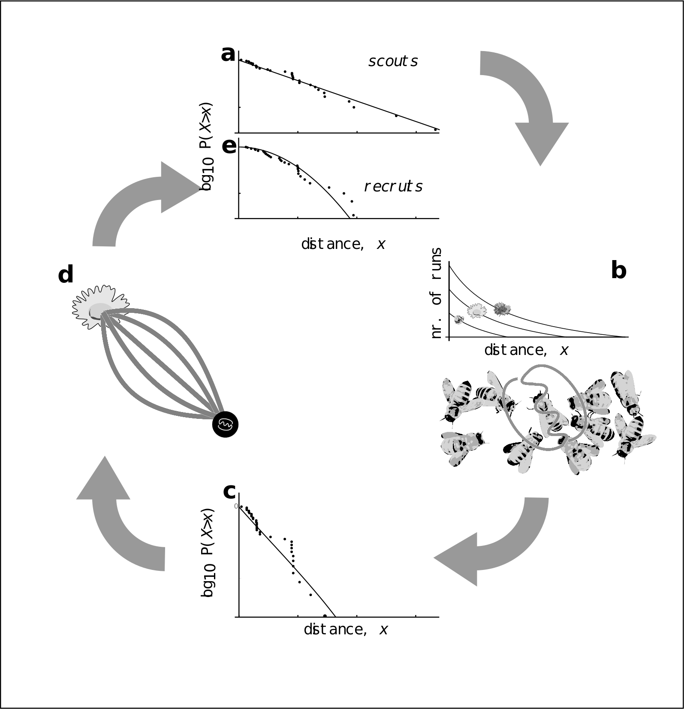
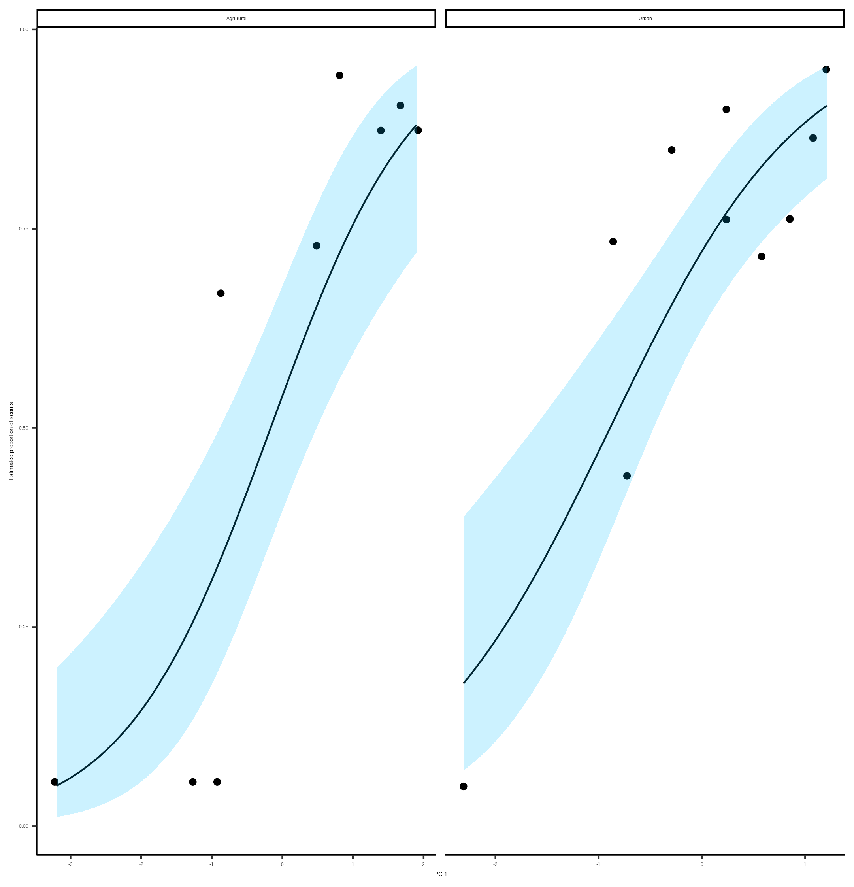

```{r setup, include=FALSE}
knitr::opts_chunk$set(echo = FALSE)
library(showtext)
showtext_auto()

knitr::opts_chunk$set(
  collapse = TRUE,
  comment = "#>",
  fig.path = "man/figures/README-",
  out.width = "100%"
)
library(ggplot2)
theme_set(
  theme_classic() +
    theme(
      text = element_text(size = 18)
    )
)

library(dplyr)
library(kableExtra)
library(flextable)
library(tibble)
```

# Abstract

Collective foraging requires that the emergent behaviour of an animal group takes a form that extends beyond the superposition of numerous individual contributions [@Sumpter2006], such that complexity is achieved at the level of the group or system, rather than the individual. Whilst collective foraging has been suggested to occur for many animal species (insert refs list), establishing if, and to what degree, animal groups make collective decisions remains a challenge. Here, we present a model of foraging by honeybees that can be used to distinguish collective decisions from individual-driven group behaviour. By confronting this model with waggle dance data from twenty hives, collected across two years, we can infer to what extent each colony depends on collective foraging vs individual decision-making. Our model both illustrates how a social insect group achieves superorganismal behaviour, and provides a tool to study variation in the occurrence of this behaviour across ecological scenarios.

# Main

Foraging is a complex task requiring exploration and exploitation of the environment. Individual foragers gather and process information independently to decide what and where to forage. A collective can foraging differently. Through the evolution of 'simple' behavioural rules, individual information can be pooled and assessed collectively, allowing informed foraging decisions to emerge from the interactions between individuals. Such systems allow a collective to reap the rewards of working together, however, in some environments individual rather than collective decision making has been shown to provide a more profitable foraging strategy. This suggests collective Vs individual information is flexibly used in response to the environment, yet this relationship is poorly understood. Understanding how environmental factors influence the prioritisation of different streams of information is critical for identifying the conditions which lead to the evolution of collective decision making and how group living animals might respond to an expanding human world. Empirically assessing whether an emergent behaviour is occurring requires comparing the actions and decision making of a collective with that of individual actors. This is fundamentally difficult as in most cases we can observe one, or the other, but not both.

Honeybees are widely understood to forage collectively for nectar due to their use of the celebrated “waggle dance”, which conveys the location of a profitable resource as a vector of distance (duration of the waggle run) and direction (angle of the dance) [@Frisch1993]. Resource “quality” is not encoded in the form of the dance itself, but in the number of waggle runs performed [@Frisch1993; @Boch1956; @Esch1961; @Seeley1994; @Seeley2000]. Although bees that follow dances do not specifically interpret this information on an individual level [@Hasenjager2021], the resulting over-representation of high-quality sites on the dance-floor means that they are more likely to encounter dances that advertise better forage [@Seeley1995]. This creates a feedback mechanism through which the hive processes the information collected and proportionally selects the most profitable resources [@Seeley1994A]. Despite the efficiency benefits potentially afforded by this sophisticated collective behaviour, its contribution to colony foraging success remains unclear. In many situations, colonies that are prevented from communicating via dance behaviour achieve equal or even greater foraging success than their wild-type counterparts [@Sherman2002; @Dornhaus2004; @Price2019]. In some ecological circumstances, individuals that forgo waiting for dance information in favour of individual search, termed “scouting”, may find food more quickly, and evidence suggests that bees adopt this strategy if the benefits of dance-following drop.

Even though this mechanism has been described in detail [@Seeley1995] (+ other refs), here we go beyond this and show that the information in the honeybees’ waggle dance bears evidence of collective decision making in foraging. To do this, we evaluate the empirical signatures of collective foraging and collective decision making in honeybee foraging patterns in the resource distances conveyed in the waggle dance.

A foraging scout locates the best resource in what is essentially a one-dimensional environment, searching along a trajectory and reporting the best resource encountered. The collective can do something different. By pooling and weighting the information present on the dance floor, a collective solves this problem for a two-dimensional environment by integrating multiple sources of information. Consequently, the difference in foraging behaviours between scouts and recruits should manifest itself in the distribution of the distances reported on the dance floor, as each sample of dances reportedly comes from a different foraging strategy.

To demonstrate that these two forms of foraging can be distinguished by the resource distance distributions that they generate, we simulated different ways in which collectives can solve such a computational task. In our simulations, foragers leave a central place, the hive, explore the environment and report back when they have visited a profitable resource. We placed resources of different qualities, representing different types of flower patches, at random positions in the environment. Patches were periodically replaced to simulate patch turnover. Visits by a forager also reduced a patch's profitability by one to simulate resource depletion.

We simulated honeybee foraging by dividing workers into scouts and recruits. Scouts follow a random path from the central place until they find a suitable resource (Fig 1 A) and then return to the hive to dance for this resource. Recruits sample a dance randomly from the pool of available dances on the dance-floor and visit this resource, also dancing on return as a scout would (Fig 1 B). Resources that are highly profitable, in terms of the quality of the resource and the energy spent in collecting it, elicit more dance runs.

```{r, fig.cap="Figure 1. A. Outline of scout foraging. Scouts leave the hive on a random flight path (white lines) and continue until they encounter a resource (flowers in the figure). B. Outline of foraging with recruitment. Scouts continue to identify resources but recruits sample available dances provided by recruits and other scouts. C. Log inverse frequency distribution of foraging distances reported by scouts. D. Log inverse frequency distribution of foraging distances reported by recruits."}
knitr::include_graphics("../results/figures/simulation.png")
```

As which individuals forage as recruits or as scouts is known in the simulation, the resulting patterns of foraging distances reported by each group can be examined. Assuming patches are placed randomly in an environment their discovery from a random search is akin to sampling from a Poisson process and so the distances between a centrally located hive and different flower patches would be expected to follow an exponential distribution (see methods). Recruits on the other hand are thought to be biased towards the more profitable resources. Assuming patch profitability should be uniform with respect to the hive’s location, this selection for the most profitable resource should create a bias for resources which are closest to the hive (see methods). Considering this bias, we expect the distribution of recruit-reported foraging distances to be well described by a distribution describing the minimum of an exponential.

Fig.s 1c and 1d show that the shapes of the resource distance distributions under the two simulated scenarios are very different. The distribution of the first simulation is akin to that of an exponential distribution, which is the nearest neighbour distance distribution for foragers operating in a one-dimensional environment (see methods). The distribution of the distances reported by recruits is well described by a Rayleigh distribution which is the nearest neighbour distribution of a two-dimensional environment (see methods).

The shape of the distance distribution, therefore, carries information about the extent to which honeybee colonies collectively make foraging decisions. We used this to design a method to analyse to waggle dance data to determine the relative importance of individual and collective behaviour in the foraging of a hive.

The frequency with which a flower patch is reported on the dance-floor is therefore different from the frequency of visits to the resource. Foragers report distances to the resources that they have visited on the dance floor, but how often they repeat a dance depends on the profitability of the resource: the more profitable, the more often it is danced for [@Seeley1986; @Seeley1994A].Our simulations show that the distributions of distances reported by scouts and by recruits are different. However, on the dance-floor the distribution of distances is modified through the profitability of a resource reported.

Honeybees achieve this by measuring the energetic efficiency of a foraging trip through the ratio of energetic gain to energetic cost [@Seeley1994A]. Combined with the distance distributions identified from our simulations, we form a prediction of the distances reported on the dance-floor as a superposition of scout and recruit foraging (see Methods). This yields two different models: a collective model demonstrating collective decision making, and an individual model where decisions are made individually. By confronting these models with waggle dance data we can infer to what extent colony foraging depends on individual or collective decision making.

```{r, fig.cap="Figure 2: Model of honeybee foraging. Flowers advertised by scouts are distributed exponentially (a). These dances are advertised on the dance floor (b) in relation to their profitability, meaning sampling recruits are biased to the more profitable (and closer) resources (c). After visiting advertised resources, recruits also dance for them leading to higher recruitment (d) which overall skews the distribution of distances reported on the entire dance floor (e)."}

```

To evaluate the collective decision making of a honeybee colony, we analysed a dataset of 3378 waggle dance observations from 20 observation hives between April-September 2017, previously described in [@Samuelson2021]. Hives were situated at different locations in the Southeast of England (see methods, figure 3A) and were visited every two weeks for a period of 24 weeks. On each visit, two hours of continuous waggle dance data were recorded by training a camcorder onto the dance floor. The footage of the dances was decoded manually to identify reported foraging locations [@Couvillon2012; @Schurch2019]

For 17 out of 20 study hives, the collective model provided a better explanation of the data than the individual model (Fig. 3a). Across 17 of the sites, the collective model was not statistically different from the empirical foraging distances, whereas the scout model was significantly different to the data in 8 of the sites (Fig. 3.b). Sites ZSL (Fig. 3c) and STU (Fig 3d) are representative examples showing the model fits. For ZSL the collective model describes foraging distances extremely well and no significant difference is observed between the model and empirical foraging distances (AIC: 569, Bootstrapped KS statistic: d = 0.06, p = 0.395). In contrast the scout model and empirical foraging distances are significantly different, providing a worse explanation of the data (AIC: 622, KS statistic: d = 0.122, p < 0.01). For STU the collective model provides a slightly better fit (KS: d = 0.04, p = 0.999) than the scout model (KS: d = 0.05, p = 0.998), however, the scout model is more parsimonious (AIC: 388) than the collective model (AIC: 393).

```{r, fig.cap="Figure 3. A. Location of study hives in Southern England coloured by which model, collective (black circles) or individual (red triangles) provided the best explanation of the data as indicated by lowest AIC score. Sites STU and ZSL (C & D) are marked. Inset plot shows the location of the sites within the UK. B. Distribution of goodness of fit confidence values for each model fit to waggle dance derived foraging distances from each site. P value is derived from a bootstrapped two-sided KS test comparing the fitted model predictions to the empirical data. The red dashed line marks the significance threshold of 0.05. Values greater than 0.05 indicate no statistically significant difference is observed between the model and the data, indicating the model provides a good fit to the data. C. Model fits to waggle dance derived foraging distances collected from the ZSL hive along with histogram showing distribution. D. Model fits to waggle dance derived foraging distances collected from the STU hive along with histogram showing distribution. Model fits show the compliment cumulative frequency distribution, giving the probability of sampling a value greater than or equal to x."}
knitr::include_graphics("../results/figures/sites_model_plot.png")
```

Our results indicate that decision making in honeybee foraging in most cases has a collective component. The mechanism of honeybee foraging and observation and how this translates into dancing has been well-studied and long known (needs refs, including Von Frisch?). We know that scouts discover resources and recruits randomly sample from a dance floor biased by flower quality from empirical [@Seeley2000] and model studies [@Seeley1991]. Our findings here go a step further and provide evidence of collective foraging and decision making beyond the confines of an experimental setup designed to identify such behaviours.

Whilst the finding that honeybees forage collectively is unlikely to elicit surprise, our model represents one of the few descriptions of colony foraging which can be related back to theoretical narratives. Much of the evidence for the established narrative are rooted in theory, with simulations providing much of the existing numerical descriptions (refs). Agent Based Simulations provide a detailed description of a model system, however, such models are often heavily parameterised and not assessed for parsimony through means such as AIC. Due to the nature of these methods, it is very difficult to compare findings to empirical data. The model outlined here is comparable to data and does not require any manipulation of the colony being studied unlike other empirical methods.

By taking decisions collectively, a colony of honeybees acquires the computational means of locating the best resource in its environment. In this sense, the capability of the hive exceeds those of an individual forager. Honeybee colonies have often been held up as an example of a superorganism, where the collective can do things beyond the capabilities of individuals. In terms of foraging, our results largely support this view and underline the importance of collective decision making in honeybees. Nevertheless, whilst most of our study hives showed the collective model provided the best fit, for some sites the individual model outperformed the collective model, reinforcing the idea the waggle dance is used flexibly in response to the environment (refs).

The idea that the waggle dance represents a plastic response is not new. Simulations and empirical studies [@Dornhaus2006; @Beekman2008; @Price2019] have suggested the waggle dance may not always provide the optimal foraging strategy for a colony, instead suggesting it is more productive to forage individually when resources are sparse. In many cases it is difficult to evaluate such claims by observing ‘natural’ hives foraging on the landscape rather than feeders. Nevertheless, empirical studies using hive disorientation, whereby the ability to gain accurate information from the waggle dance is removed, have suggested it can be more beneficial to ignore the dance and forage individually, supporting the findings from simulation studies. This approach does not remove all aspects of social information, such as olfactory cues, and can only show if there is a benefit to using the waggle dance, not whether a colony actively down regulates their use of social information [@Hasenjager2020].

The model outlined here provides an estimate for the use of the waggle dance by a colony in the form of the proportion of scout dances. By quantifying waggle dance use, our model provides a tool to study variation in the use of social information across ecological scenarios. To demonstrate this, we first performed a land-use classification of the environment around each of our study sites (see methods, cite the land use paper by Ash). As our sites were in either an agricultural-rural or urban landscape, we developed different land-use categories for the two groups and performed a partial least squares analysis to identify the land-use type combinations which explained the most variation in the proportion of scouts across the two environments.

```{r, fig.cap="Figure 4. Estimated proportion of scouts for each site in the Agri-rural (left) and Urban (right) landscapes against the first principle component from a Partial Least Squares analysis of land-use type. A beta regression shows the relationship (black line) between PC1 and the proportion of scouts, with 95% CI shown by the blue shaded area."}

```

In the Agri-rural environment a single PC explained ~60% of the variation in the proportion of scouts (beta regression: $R^2$ = 0.6, $\phi$ = 4.9, p < 0.05, Fig. 4). This PC correlates positively with arable land and negatively with non-agricultural unmanaged green space, built up areas and water. Arable land is typically nutritionally poor for honeybees (ref). On the contrary, non-agricultural unmanaged green space is typically nutrient rich, as are built up areas in agri-rural environments, which often have gardens with ample flowers available for pollinators (ref). Water also correlated negatively with the estimated proportion of scouts, possibly due to river and pond banks providing good floral resources for pollinators (ref). Combined, these results suggests when resources are sparse and difficult to find, as with arable land-use, individuals value personal information more than when easier to find, as with the non-agricultural unmanaged green space, built up areas and water.

```{r, agri-rual-loadings}
set_flextable_defaults(
  big.mark = " ",
  font.size = 10, theme_fun = theme_vanilla,
  padding.bottom = 6,
  padding.top = 6,
  padding.left = 6,
  padding.right = 6
)

load("../results/pls-loadings.RData")
argi.rural.loadings <- tibble(
  "Land-use" = names(agrirural_loadings$loadings),
  "PC1" = agrirural_loadings$loadings
)

urban.loadings <- tibble(
  "Land-use" = names(urban_loadings$loadings),
  "PC1" = urban_loadings$loadings
)

argi.rural.loadings %>%
  mutate(PC1 = round(PC1, 3)) %>%
  mutate(`Land-use` = gsub("\\.", " ", `Land-use`)) %>%
  flextable() %>%
  set_caption(
    "Land-use type loadings for the first principle component on the Agri-rural sites. Bold face indicates loadings that contribute more than would be expected under a null hypothesis of equal contribution"
  ) %>%
  set_table_properties(layout = "autofit") %>%
  bold(
    i = ~ PC1 > agrirural_loadings$cutoff |
      PC1 < -agrirural_loadings$cutoff,
    j = "PC1"
  )

```

A similar effect is also observed in the urban environment, where a single PC explained ~61% of the variance in the proportion of scouts (beta regression: $R^2$ = 0.61, $\phi$ = 7.4, p < 0.05, Fig. 4). This PC correlates positively with continuos central land, dense residential land and water, whilst correlating negatively with sparse residential and amenity grassland. This relationship appears to be largely driven by a single site showing a model of only individual foraging as the best fit. Nevertheless, as with the agri-rural land-uses, these results indicate when resources are sparse, as could be expected in continuos central and dense residential land, where there is limited space for floral resources, a colony emphasises the use of personal rather than social information. However, when resources are more abundant, as could be expected in sparse residential areas and amenity grasslands, a colony appears to increase the use of information contained in the waddle dance. Unlike in the agri-rural environment, water correlates positively with a higher use of the waggle dance. This likely indicates that the banks of urban water ways are less nutritionally rich than in agri-rural landscapes.

```{r, urban.loadings}
urban.loadings %>%
  mutate(PC1 = round(PC1, 3)) %>%
  mutate(`Land-use` = gsub("\\.", " ", `Land-use`)) %>%
  flextable() %>%
  set_caption(
    "Land-use type loadings for the first principle component on the urban sites. Bold face indicates loadings that contribute more than would be expected under a null hypothesis of equal contribution"
  ) %>%
  set_table_properties(layout = "autofit") %>%
  bold(
    i = ~ PC1 > urban_loadings$cutoff |
      PC1 < -urban_loadings$cutoff,
    j = "PC1"
  )

```

This analysis identifies associations between land-use types and the use of the waggle dance which follow what is predicted under theoretical models [@Dornhaus2006; @Beekman2008]. In addition, these findings provide an insight into how human land-use change through urbanisation and agricultural intensification influence how honeybees use the waggle dance. These results indicate that human activity is selecting honeybees to ignore social information in favour of individual information. However, in the urban environment, the land-use type which would be expected to be the most florally rich for pollinators (parks, allotments and cemeteries) showed no significant correlation with the main axis of variation in the proportion of scouts, indicating the relationship is more nuanced than previously thought.

To what extent social information is used when making foraging decisions, as well as the value of personal information, has been a matter of considerable debate (refs). Much of that debate is informed by simulation studies (ref), and empirical work in which a relatively small number of individuals are observed (ref). Here, we demonstrate that the analysis of waggle dance data can make an important contribution to this debate. With the advances in the decoding of the waggle dance through automated methods [@Wario2017], we face the prospect of waggle dance data becoming “big data”. Our methodology provides a means of analysing such large data sets and gleaning useful information on the importance of such data to inform the debate about the importance of social information, as well as providing useful colony metrics of foraging activity.

Overall, our results strongly suggest honeybee foraging occurs through collective decision making. In developing this model and applying it to real waggle dance data, our results provide evidence supporting collective foraging in honeybees and supports existing theoretical models describing collective foraging in honeybees. The methods described herein provide a less invasive and empirically reinforced means of approaching questions such as the importance of the waggle dance in foraging, and with this, deeper questions about the value of social vs individual information for honeybees in different environments.


# References
