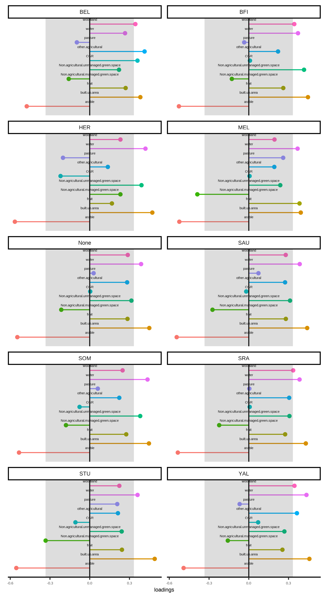
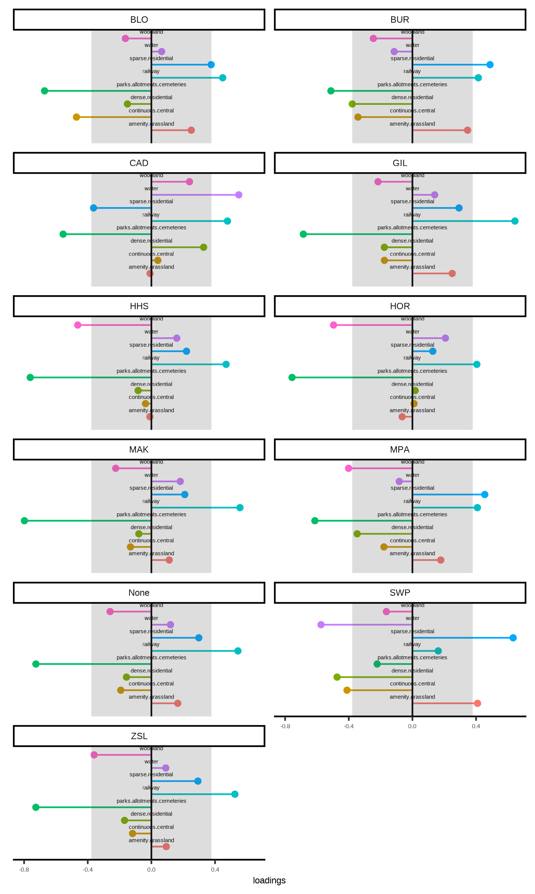

```{r setup, include=FALSE}
knitr::opts_chunk$set(echo = FALSE)
library(showtext)
showtext_auto()

knitr::opts_chunk$set(
  collapse = TRUE,
  comment = "#>",
  fig.path = "man/figures/README-",
  out.width = "100%"
)
library(ggplot2)
library(cowplot)
theme_set(
  theme_classic() +
    theme(
      text = element_text(size = 18)
    )
)

library(dplyr)
library(kableExtra)
library(flextable)
library(tibble)
library(purrr)
library(gridExtra)
library(grid)

# load fitting results / stats
load("../results/site_fit_results.Rdata")
```


# Waggle dance model

# Waggle dance model fit

```{r, all-model-fits, fig.width=10,fig.height=11, fig.cap="Supplementary Fig 1. **Cumulative frequency distribution** of waggle dance durations and fits of the collective (red line) and individual (blue line) models for all 20 sites."}
plots <- map(all_sites, 2)
plots <- plots %>%
  map(
    ~ {
      .x + theme(
        axis.title.x = element_blank(),
        axis.title.y = element_blank()
      )
    }
  )

allsites_plot <- plot_grid(
  plotlist = plots, nrow = 5,
  hjust = -0.1, label_x = 0.7,
  labels = names(plots)
)
y.grob <- textGrob(
  "cumulative frequency",
  gp = gpar(fontsize = 18),
  rot = 90
)
x.grob <- textGrob(
  "waggle run duration (s)",
  gp = gpar(fontsize = 18)
)

# add to plot
grid.arrange(arrangeGrob(allsites_plot, left = y.grob, bottom = x.grob))
```

Table 1. shows the results of the model fitting, including likelihood scores, parsimony measures -AIC, delta_AIC, rAIC (relative delta_AIC) and wAIC (Akaike weights)- and goodness of fit -Ks statistics (ks_statistic, ks_pvalue)- for all 20 sites.

```{r, model-fit-results}
set_flextable_defaults(
  big.mark = " ",
  font.size = 10, theme_fun = theme_vanilla,
  padding.bottom = 6,
  padding.top = 6,
  padding.left = 6,
  padding.right = 6
)

# group all site results together
df <- map(all_sites, 1) %>%
  bind_rows()

# calculate other AIC stats
df2 <- df %>%
  group_by(site) %>%
  mutate(
    delta_AIC = AIC - min(AIC),
    rAIC = exp(-0.5 * delta_AIC),
    wAIC = rAIC / sum(rAIC)
  ) %>%
  select(
    site, model, loglikelihood, AIC, delta_AIC, rAIC, wAIC,
    p, bs, br, as, ar, k, ks_statistic, ks_pvalue
  )

write.csv(df2, "../results/modelfits_allsites.csv")

# set up proper names
# format table
df2 %>%
  arrange(site) %>%
  mutate(across(where(is.numeric), round, 3)) %>%
  rename(
    MLE = loglikelihood,
    "ΔAIC" = delta_AIC,
    D = ks_statistic,
    p_value = ks_pvalue
  ) %>%
  select(-k) %>%
  flextable() %>%
  set_caption(
    "Fit results for the fitting of the waggle dance model to each site."
  ) %>%
  set_table_properties(layout = "autofit") %>%
  fit_to_width(7.5)
```

# Jackknifed partial least squares analysis

```{r, rural-pls-loadings, fig.width=10,fig.height=11, fig.cap="Supplementary Fig 2. **Loadings of PLS calculated for each site removed for the agri-rural sites**. Each plot shows the loadings of the first principle component with that site removed from the analysis, showing the individual points making up the overall box plot loadings in Fig 4b."}

```

```{r, urban-pls-loadings, fig.width=10,fig.height=11, fig.cap="Supplementary Fig 3. **Loadings of PLS calculated for each site removed for the urban sites**. Each plot shows the loadings of the first principle component with that site removed from the analysis, showing the individual points making up the overall box plot loadings in Fig 4d."}

```