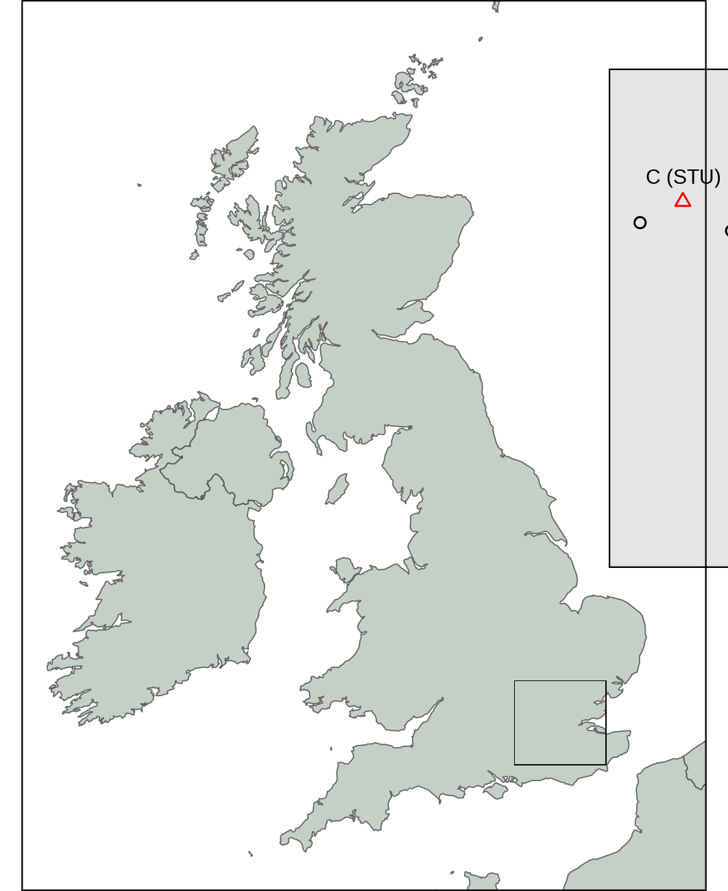
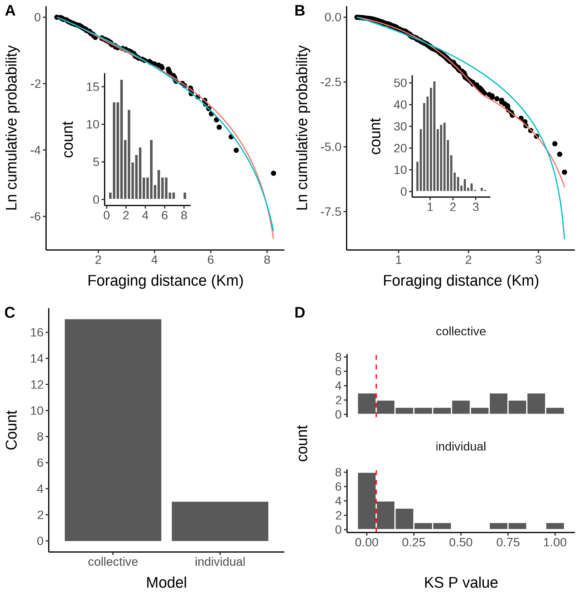
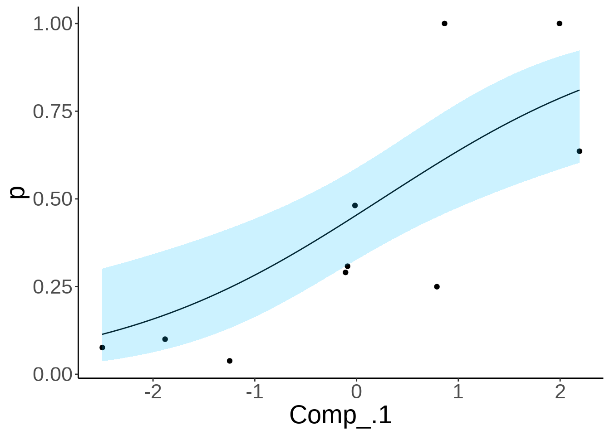
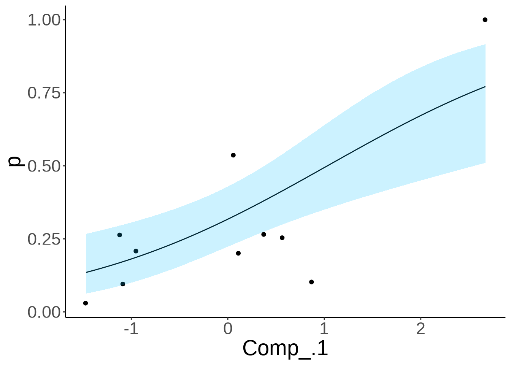

<style type="text/css">
.caption {
    font-size: small;
}
.refs {
    font-size: small;
}
</style>

```{r setup, include=FALSE}
knitr::opts_chunk$set(echo = FALSE)
library(showtext)
showtext_auto()

knitr::opts_chunk$set(
  collapse = TRUE,
  comment = "#>",
  fig.path = "man/figures/README-",
  out.width = "100%"
)
library(ggplot2)
theme_set(
  theme_classic() +
    theme(
      text = element_text(size = 18)
    )
)

library(kableExtra)
library(tidyr)
library(dplyr)
```

## Collective behaviour through self-organisation

- Social insects often live in groups of hundreds or even thousands strong
- Successfully coordinate themselves to work as a cohesive unit
- Not a directed process, occurs through self-organisation
- All individuals follow a given set of rules and a collective pattern **emerges**
- Self organisation pools and weighs individual information to produce an informed collective response [@Sumpter2006,Myerscough2003,Franks2002].

## Honeybee foraging

>- Evolved a unique dance language to provide the distance and direction of a food source to nest-mates

>- Studied intensively to uncover the rules governing dancing [@Seeley1995]

<div style="float: left; width: 49%;">


</div>

<div style="float: right; width: 49%;">

1. Foragers dance in relation to foraging efficiency [@Seeley1986,Seeley1994A].
2. Foragers use the time taken to find a worker to unload them of nectar when returning from foraging as an indicator of how desperate the colony is for nectar [@Seeley1986].
3. Recruits don't compare dances [@Seeley1992].

</div>

## Honeybee foraging

- Combined, these rules are hypothesised to work as a self-organised process [@Seeley1995].

- Scouts explore the landscape for forage and perform dance runs based on foraging efficiency
- Recruits, sampling randomly, are biased to the best resources
- Recruits return to dance just like scouts
- Individual assessments are pooled on the dance-floor
- Collective finds the best resources
- Individual parts have significant empirical support
- Combine to produce a coherent theory widely accepted to be true


- **Overall hypothesis has not been empirically validated or tested!**

## Why do we need to evaluate this theory?

- Key question in collective behaviour is what conditions lead to the evolution of sociality and cooperation? [@King2007,Sumpter2006,Gordon2016]
- Knowing how the waggle dance is used indicates how much a colony values social vs personal information [@IAnsonPrice2015].
- Multiple theoretical [@Dornhaus2006,Beekman2008] and empirical studies [@Gruter2009,Gruter2011,Wray2012,Schurch2014,Price2019] have reached conflicting conclusions about the importance of the waggle dance.
- New methods are needed to better understand the waggle dance and how it is used.

## Objective

- Construct a model of honeybee foraging based off the generally accepted narrative
- Contrast this with an individual based foraging model
- Evaluate these models on real foraging data

## Where to start?

- Impossible to track individual behaviour to model data against
- Does a particular foraging behaviour leave an imprint on the dance-floor?
- If scouts and recruits forage differently, will this difference reflect in the pattern of waggle dances each group performs?

## Simulation

*Are different foraging strategies identifiable from the distribution of foraging distances reported on the dance floor?*

We created an Agent Based Simulation of a foraging honey bee colony.

---

{width=100%, height=50%}

---

<center>
**Different foraging strategies leave different patterns in the distribution of foraging distances reported on the dance floor**.
</center>

## Constructing the waggle dance model

- Assume scouts search an environment without information and report back the first resource found. **$\lambda_s e^{-\lambda_s x}$**
- Recruits sample randomly from the dance floor (scouts + other recruits).
- Recruits over-represent the best resources, skewing the distribution of dances. **$2 \lambda_r \pi x e^{-\lambda_r \pi x^2}$**
- Seeley suggests dancing is regulated by efficiency: $\frac{gain-cost}{cost}$.
- Energy gained is $\propto$ quality $q$, cost increases linearly with distance, $x$.
- Can therefore refactor efficiency as: $\frac{q}{1+\alpha x} - 1$, where $\alpha$ is the energy spend per unit of distance.

## Constructing the waggle dance model | Putting it all together

<center>
$$\sigma(q, x) ( p \lambda_s e^{-\lambda_s x} + (1-p) 2 \lambda_r \pi x e^{-\lambda_r \pi x^2})$$
</center>

<br>

>- The distribution of reported distances is a superposition of recruit and scout distance distributions.
>- $p$ provides a proportional weighting of the number of dances coming from either a scout or recruit strategy.


## Fit to actual data

*Do colonies in real world environments forage collectively, individually or through some other mechanism?*

- Waggle dance data was collected and decoded from 10 urban and 10 agri-rural sites over the 2017 season for a total of > 3000 dances (Credit: Ash Samuelson).
- Fit our full model to the distribution of foraging distances recorded for each site.
- Also fit an individual only model ($p$ fixed to 1) to evaluate an individual only foraging strategy.
- Model selection used to determine which strategy was more likely.
- Model fit used to determine if our model offered a good explanation of the data.

---

<div style="float: left; width: 45%;">

{width=95%, height=95%}

<p class = caption>
Location of hive sites across southern England. Black circles indicates the collective model provided the best fit to the data in that site, whilst red triangles indicates the individual model provided a better explanation of the data. The greater London area is indicated by the dark grey shading (inset map).
</p>

</div>

<div style="float: right; width: 50%;">

{width=86%, height=86%}

<p class = caption>
Model fits to foraging distance distributions decoded from waggle dances in sites ZSL (A) and STU (B). The Y axis in A and B is the inverse log-cumulative frequency, indicating the log probability of a foraging distance being greater than or equal to $x$. Inset plots show the frequency of dances advertising foraging distances. C. Number of sites where the collective and individual models provided the best explanation of the data. D. Distribution of KS statistic P values across the sites for the collective (top) and individual (bottom) models. A value greater than 0.05 indicates there is no significant difference between the empirical distribution of the data and the model applied.
</p>

</div>

## Conclusions

- We have successfully translated the dominant theoretical understanding of honeybee foraging into a quantifiable and thus measurable model.
- Evaluated this model against a large empirical dataset to show that in the majority of cases it provides an extremely good explanation of foraging patterns.
- In some cases, a model of individual behaviour is more suitable
- Provides new evidence that honeybees can regulate the use of the waggle dance and use personal rather than social information at a colony level.
- Provides a new, non-invasive  tool to evaluate what factors might influence how honeybees use the waggle dance.

## Latest work (Brand new stuff!)

- Waggle dance use tells us how social and personal information is valued
- Environmental factors are thought to influence the use of the waggle dance and social information more broadly.
- Intensely studied in honeybees using theoretical and empirical studies.
- Empirical studies rely on hive disorientation
- Tells us if a colony does well with or without the dance in a given environment
- Can't tell us if a colony actually **responds** to the environment by altering their foraging strategies

- Our model provides a new way of evaluating how external factors might inlfunece the use of the waggle dance.
- Fitting our model to data gives us a proportion of scout dances $p$, providing an estimate of what the foragers are doing (working alone or following others) based on what they report.

---

>- In addition to understanding what conditions gave rise to the evolution of social foraging, there is significant attention on understanding how anthropogenic activities are impacting social insects.
>- Urbanisation and expanding Agricultural practices represent two of the biggest land-use changes imposed by humans.
>- Understanding what effect this has on the use of social information is an important question.

<div style="float: left; width: 50%;">

{width=95%, height=95%}

<p class = caption>
Urbanisation.
</p>

</div>

<div style="float: right; width: 50%;">

{width=84%, height=84%}

<p class = caption>
Agricultural expansion
</p>

</div>

---

```{r, prop-scouts-LU, echo = FALSE, message = FALSE, warning = FALSE}

# load results of model fit (code to generate found in fit_models.Rmd)
sitedata <- readRDS("results/site_fit_results.Rda")

# filter for best model
sitedata <- sitedata %>%
  group_by(site) %>%
  slice(which.min(AIC))

# foraging distance data
df <- read.csv("data/FullHBForagingData.csv")

# join LU on to sitedata
sitedata.lu <- df %>%
  select(site, LU) %>%
  unique() %>%
  inner_join(sitedata, on = "site")

ggplot(sitedata.lu, aes(y = p, x = LU)) +
  geom_boxplot(binwidth = 1, colour = "black")
```

- No real difference in the proportion of scouts between Agri-rural and Urban areas.

## Influence of land-use type on the proportion of scouts

*Is there a relationship between land-use type and proportion of scouts?*

- The foraging land around each site was classified by their different land-use types (Credit: Ash Samuelson)
- Urban: continuous central, dense residential, sparse residential, parks allotments cemeteries, amenity.grassland, Railway, woodland, and water.
- Agri-rural: woodland, Non agricultural unmanaged green space, Non, agricultural managed green space, arable, pasture, other agricultural, fruit, Oil Seed Rape, built up area, and water.

## Partial Least Squares analysis (PLS)

<div style="float: left; width: 50%;">

>- Similar to a Principle Component Analysis (PCA).
>- PCA finds the major axis of variation in the data and relates this to a response variable.
>- PLS finds the major axis of variation in the response variable.
>- Allows you to evaluate what land-use types most influence the variation in the proportion of scouts.

</div>

<div style="float: right; width: 50%;">

{width=95%, height=95%}

</div>

## PLS - Agri-rural

<div style="float: left; width: 45%;">

>- A single PC explained ~60% of the variation in the proportion of scouts.
>- There is significant positive relationship between PC1 and the proportion of scouts (Beta regression: R$^2$ = 0.60, df = 3, p < 0.05).

</div>

<div style="float: right; width: 50%;">

{width=95%, height=95%}

</div>

---

<div style="float: left; width: 25%;">

```{r, echo=FALSE,out.width="65%", out.height="10%",fig.cap=""}
land.types <- c(
  "https://stmaaprodfwsite.blob.core.windows.net/assets/sites/1/2015/04/farmland.jpg",
  "https://encrypted-tbn0.gstatic.com/images?q=tbn:ANd9GcSeyllkO-dj0vCIfqb7vSN18gpkiB-7fn74Mw&usqp=CAU",
  "https://encrypted-tbn0.gstatic.com/images?q=tbn:ANd9GcQVDhSwdnZ32zYO4gw39oKxY9QSygjB2gIXJg&usqp=CAU",
  "https://hips.hearstapps.com/hmg-prod.s3.amazonaws.com/images/haweswater-reservoir-cumbria-1531212664.jpg"
)
knitr::include_graphics(land.types)
```

</div>

<div style="float: right; width: 75%;">

>- PC1 correlates:
>- **positively** with **arable land**
>- **negatively** with **Non agricultural unmanaged green space, built up areas and water**.

- Arable land are typically deserts for pollinators
- Unmanaged green space has space for wild flowers
- agri-rural built up areas typically have green space in the form of gardens
- water ways typically have lots of flora on river and pond banks
- Suggests when resources are sparse and difficult to find, a colony responds by increasing the proportion of scouts to explore the landscape.

</div>

## PLS - Urban

<div style="float: left; width: 45%;">

>- The first PC explains ~61% of the variation in the proportion of scouts.
>- There is significant positive relationship between this PC and the proportion of scouts (Beta regression: R$^2$ = 0.61, df = 3, p < 0.05).

</div>

<div style="float: right; width: 50%;">

{width=95%, height=95%}

</div>

---

<div style="float: left; width: 25%;">

```{r, echo=FALSE,out.width="65%", out.height="10%",fig.cap=""}
land.types <- c(
  "https://olympia.london/sites/default/files/styles/main_full_width__mobile/public/local-area/High_street_kensington_olympia_Main.jpg?itok=7wzMLoSz",
  "https://www.telegraph.co.uk/content/dam/property/2016/09/28/1507111_Views_From_The_Barbican_Estate_On_Its_40th_AnniversaryLONDON_ENGLAND_-_JULY_07__A_general_vi_trans_NvBQzQNjv4BqyILZCJqFaBEpuz3ivC4GStDyCNk0iIla_0j06bseVEE.jpg",
  "https://architizer-prod.imgix.net/media/1478153409182project_london-river-park_07.jpg?fit=max&w=1680&q=60&auto=format&auto=compress&cs=strip",
  "https://labmonline.co.uk/wp-content/uploads/2020/03/MHCLG-eviction-ban.jpg",
  "https://i.guim.co.uk/img/media/913e25493e4d9b4cd1d2e7e535639a11765285a3/0_0_4032_3024/master/4032.jpg?width=445&quality=45&auto=format&fit=max&dpr=2&s=ff60726e82d18bb4c8af7e696e74cc7c"
)
knitr::include_graphics(land.types)
```

</div>

<div style="float: right; width: 75%;">
>- PC1, explains ~61% of the variance in the proportion of scouts, correlates:
>- **Positively** with continuos central land, dense residential and water.
>- **Negatively** with sparse residential and amenity grassland.

- Continuos central typically has very few resources for pollinators.
- Dense residential areas have fewer gardens.
- Urban waterways have fewer flora.
- Sparse residential has more area for gardens.
- Amenity grassland have green boarders and space for flowers.

- Suggests when resources are sparse and difficult to find, a colony responds by increasing the proportion of scouts to explore the landscape.

</div>

## Implications

- Land-use type has a significant impact of the proportion of scouts.
- Reinforces the idea that the waggle dance is used flexibly.
- In both Agri-rural and Urban landscapes, resource poor land-use types correlate with an increase in the proportion of scouts.
- Both the urban and agri-rural analysis suggests anthropogenic activity selects colonies to ignore the waggle dance more.
- These findings support previous theoretical studies [@Dornhaus2006]
- Provides new insight into how human activity influences social information use

## Future directions

- Collect more data!
- Invest in new technologies such as automatic dance decoding software
- Generate an automated pipeline to analyse honeybee waggle dance data from our methods.

## Thank you for listening, Questions?

### Acknowledgments
Vincent Jansen, Elli Leadbeater, Ash Samuelson

### References
<div id = "refs" class = "refs columns-2"></div>

---

<div style="float: right; width: 50%;">
![Collective choice of a food source in ants: Taken from [@Detrain2006]](assets/ant-foraging-fig.jpg){width=100%, height=100%}
</div>

<div style="float: left; width: 50%;">


- Self organisation pools and weighs individual information to produce an informed collective response [@Sumpter2006].
- A similar principle is also observed in honeybees when searching for a new nest [@Myerscough2003,Franks2002]

</div>

---

1. Hive exists surrounded by resources which have a quality and distance from the hive. The resources are randomly removed and others added for simulate flower turnover.
2. A proportion of foragers act as scouts, leave the hive on a randomly determined path and report back the first patch discovered.
3. The rest act as recruits and sample randomly the pooled dances of scouts and other recruits. Once they have a location they visit that resource and also advertise it.
4. Scouts and recruits return to their flower but once that patch disappears they must return to searching or following dances respectively.

---

## Constructing the waggle dance model | Scout distribution {.build}

- Assume scouts search an environment without information and report back the first resource found.
- Floral resources should be randomly distributed around a hive and thus follow a Poisson distribution.
- The distance between a central hive and each point should therefore be exponentially distributed, with rate $\lambda_s$.

<br>
$$\lambda_s e^{-\lambda_s x}$$

## Constructing the waggle dance model | Recruit distribution {.build}

- Recruits sample randomly from the dance on the dance floor (scouts + other recruits).
- Recruits over-represent the best resources, skewing the distribution of dances.
- The best resource is implicitly a function of distance and should bias towards the closest patches to the colony.
- The chance of discovering a food source within a radius of $x$ in a circular area is: $e^{-\lambda_r \pi x^2}$, where $\lambda_r$ is the recruit discovery rate.
- The distribution of the nearest food sources that recruits would come for is: $2 \lambda_r \pi x e^{-\lambda_r \pi x^2}$

$$2 \lambda_r \pi x e^{-\lambda_r \pi x^2}$$

## Constructing the waggle dance model | Profitability function {.build}

Seeley suggests dancing is regulated by efficiency: $\frac{gain-cost}{cost}$.

- Gain is determined by the nectar quality of the flower, $q$.
- Cost is determined by the distance to the flower, $x$.
- Energy gained is therefore $\propto$ $q$, cost increases linearly with $x$.
- Can therefore refactor efficiency as: $\frac{q}{1+\alpha x} - 1$, where $\alpha$ is the energy spend per unit of distance.
- Number of dances cannot be negative, so the function must be positive:

$$\sigma(q,x) = [\frac{q}{1+\alpha x}-1]_+$$

## Constructing the waggle dance model | Putting it all together

<center>
$$\sigma(q, x) ( p \lambda_s e^{-\lambda_s x} + (1-p) 2 \lambda_r \pi x e^{-\lambda_r \pi x^2})$$
</center>

<br>

>- The distribution of reported distances is a superposition of recruit and scout distance distributions.
>- $p$ provides a proportional weighting of the number of dances coming from either a scout or recruit strategy.
