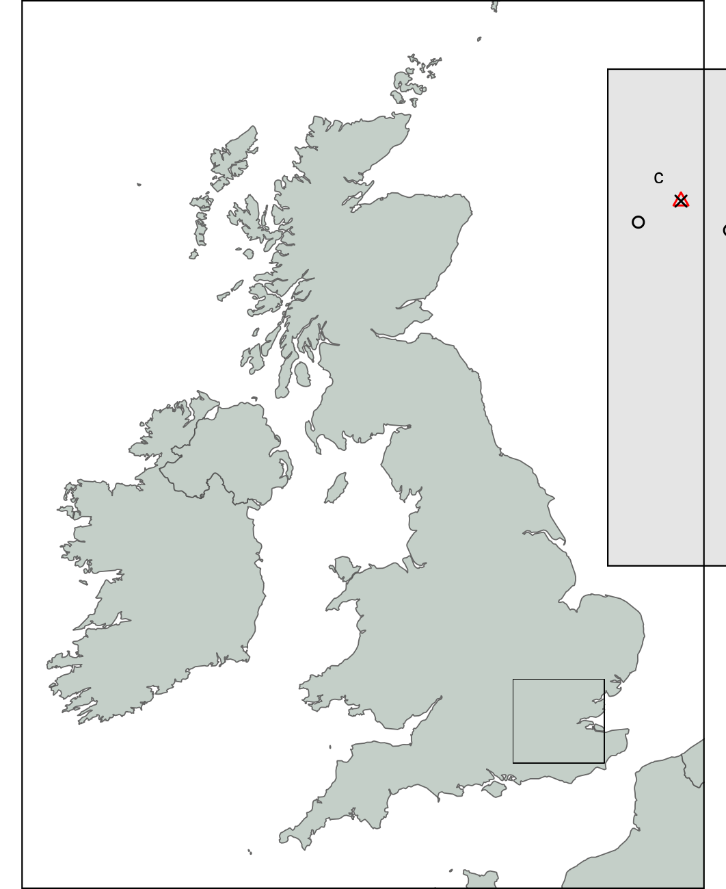

<style type="text/css">
.caption {
    font-size: small;
}
</style>

```{r setup, include=FALSE}
knitr::opts_chunk$set(echo = FALSE)
library(showtext)
showtext_auto()

knitr::opts_chunk$set(
  collapse = TRUE,
  comment = "#>",
  fig.path = "man/figures/README-",
  out.width = "100%"
)
library(ggplot2)
theme_set(
  theme_classic() +
    theme(
      text = element_text(size = 18)
    )
)

library(kableExtra)
library(tidyr)
library(dplyr)
```

## Constructing the waggle dance model | Profitability function

Seeley suggests dancing is regulated by efficiency: $\frac{gain-cost}{cost}$.

- Gain is determined by the nectar quality of the flower, $q$.
- Cost is determined by the distance to the flower, $x$.
- Energy gained is therefore $\propto$ $q$, cost increases linearly with $x$.
- Can therefore refactor efficiency as: $\frac{q}{1+\alpha x} - 1$, where $\alpha$ is the energy spend per unit of distance.
- Energy spend cannot be negative, so the function must be positive:

$$\sigma(q,x) = [\frac{q}{1+\alpha x}-1]_+$$

## Constructing the waggle dance model | Scout distribution

- Assume scouts search an environment without information and report back the first resource found.
- Floral resources should be randomly distributed around a hive and thus follow a Poisson distribution.
- The distance between a central hive and each point should therefore be exponentially distributed, with rate $\lambda_s$.
- This scout distribution is altered by the profitability function, which translates the distance of the resource to a number of dances reported on the dance floor.
- $\sigma(q, x) \lambda_s e^{-\lambda_s x}$

## Constructing the waggle dance model | Recruit distribution

- Recruits sample randomly from the dance on the dance floor (scouts + other recruits).
- Recruits over-represent the best resources, skewing the distribution of dances.
- The best resource is implicitly a function of distance and should bias towards the closest patches to the colony.
- The chance of discovering a food source within a radius of $x$ in a circular area is: $e^{-\lambda_r \pi x^2}$, where $\lambda_r$ is the scout discovery rate.
- The distribution of the nearest food sources that recruits would come for is: $2 \lambda_r \pi x e^{-\lambda_r \pi x^2}$

- $\sigma(q, x) 2 \lambda_r \pi x e^{-\lambda_r \pi x^2}$

## Constructing the waggle dance model | Putting it all together

<center>
$$\sigma(q, x) ( p \lambda_s e^{-\lambda_s x} + (1-p) 2 \lambda_r \pi x e^{-\lambda_r \pi x^2})$$
</center>

- The distribution of reported distances is a superposition of recruit and scout distance distributions.
- $p$ provides a proportional weighting of the number of dances coming from either a scout or recruit strategy.

---

<div style="float: left; width: 50%;">

{width=95%, height=100%}

</div>

<div style="float: right; width: 50%;">

<p class = caption>
Model of honeybee foraging. Flowers advertised by scouts are distributed exponentially (A), y axis is the log probability of sampling a value larger than $x$ (same for C and E). These dances are advertised on the dance floor (B) in relation to their profitability, meaning sampling recruits are biased to the more profitable (and closer) resources (C). Recruits also dance for these resources leading to higher recruitment (D) which overall skews the distribution of distances reported on the entire dance floor (E).
</p>

</div>


## Simulation

*Are different foraging strategies identifiable from the distribution of foraging distances reported on the dance floor?*

We created an Agent Based Simulation of a foraging honey bee colony.

1. Hive exists surrounded by resources which have a quality and distance from the hive. The resources are randomly removed and others added for simulate flower turnover.
2. A proportion of foragers act as scouts, leave the hive on a randomly determined path and report back the first patch discovered.
3. The rest act as recruits and sample randomly the pooled dances of scouts and other recruits. Once they have a location they visit that resource and also advertise it.
4. Scouts and recruits return to their flower but once that patch disappears they must return to searching or following dances respectively.

---

{width=100%, height=50%}

---

- **Different foraging strategies leave different patterns in the distribution of foraging distances reported on the dance floor**.

- Logic of the model holds water.

## Fit to actual data

*Do colonies in real world environments forage collectively, individually or through some other mechanism?*

- Waggle dance data was collected and decoded from 10 urban and 10 agri-rural sites over the 2017 season for a total of > 3000 dances (Credit: Ash Samuelson).
- Fit our full model to the distribution of foraging distances recorded for each site.
- Also fit a scouts only model ($p$ fixed to 1) to evaluate an individual only foraging strategy.
- Model selection used to determine which strategy was more likely.
- Model fit used to determine if our model offered a good explanation of the data.

---

<div style="float: left; width: 45%;">

{width=95%, height=95%}

<p class = caption>
Location of hive sites across southern England. Black circles indicates the collective model provided the best fit to the data in that site, whilst red triangles indicates the individual model provided a better explanation of the data. The greater London area is indicated by the dark grey shading (inset map).
</p>

</div>

<div style="float: right; width: 50%;">

{width=86%, height=86%}

<p class = caption>
Model fits to foraging distance distributions decoded from waggle dances in sites ZSL (A) and STU (B). The Y axis in A and B is the inverse log-cumulative frequency, indicating the log probability of a foraging distance being greater than or equal to $x$. Inset plots show the frequency of dances advertising foraging distances. C. Number of sites where the collective and individual models provided the best explanation of the data. D. Distribution of KS statistic P values across the sites for the collective (top) and individual (bottom) models. A value greater than 0.05 indicates there is no significant difference between the empirical distribution of the data and the model applied.
</p>

</div>

## Conclusions

- We have successfully translated the dominant theoretical understanding of honeybee foraging into a quantifiable and thus measurable model.
- Evaluated this model against a large empirical dataset to show that in the majority of cases it provides an extremely good explanation of foraging patterns.
- In some cases, a model of individual behaviour is more suitable
- Provides new evidence that honeybees can regulate the use of the waggle dance and use personal rather than social information at a colony level.
- Provides a new, non-invasive  tool to evaluate what factors might influence how honeybees use the waggle dance.

## Latest work (Brand new stuff!)

- Environmental factors are thought to influence the use of the waggle dance and social information more broadly.
- Intensely studied in honeybees using theoretical and empirical studies.
- Empirical methods are open to problems.
- Our model provides a new way of doing things.
- Fitting our model to data gives us a proportion of scout dances $p$, providing an estimate of what the foragers are doing (working alone or following others) based on what they report.

---

```{r, prop-scouts-LU, echo = FALSE, message = FALSE, warning = FALSE}

# load results of model fit (code to generate found in fit_models.Rmd)
sitedata <- readRDS("results/site_fit_results.Rda")

# filter for best model
sitedata <- sitedata %>%
  group_by(site) %>%
  slice(which.min(AIC))

# foraging distance data
df <- read.csv("data/FullHBForagingData.csv")

# join LU on to sitedata
sitedata.lu <- df %>%
  select(site, LU) %>%
  unique() %>%
  inner_join(sitedata, on = "site")

ggplot(sitedata.lu, aes(y = p, x = LU)) +
  geom_boxplot(binwidth = 1, colour = "black")
```

- No real difference in the proportion of scouts between Agri-rural and Urban areas.

## Influence of land-use type on the proportion of scouts

- The foraging land around each site was classified by their different land-use types (Credit: Ash Samuelson)

- Urban: continuous central, dense residential, sparse residential, parks allotments cemeteries, amenity.grassland, Railway, woodland, and water.

- Agri-rural: woodland, Non agricultural unmanaged green space, Non, agricultural managed green space, arable, pasture, other agricultural, fruit, Oil Seed Rape, built up area, and water.

*Is there a relationship between land-use type and proportion of scouts?*

## Partial Least Squares analysis (PLS)

<div style="float: left; width: 50%;">

- Similar to a Principle Component Analysis (PCA).
- PCA finds the major axis of variation in the data and relates this to a response variable.
- PLS finds the major axis of variation in the response variable.
- Allows you to evaluate what land-use types most influence the variation in the proportion of scouts.

</div>

<div style="float: right; width: 50%;">

{width=95%, height=95%}

</div>

## PLS - Agri-rural

<div style="float: left; width: 45%;">

- A single PC explained ~60% of the variation in the proportion of scouts.
- There is significant positive relationship between PC1 and the proportion of scouts (Beta regression: R$^2$ = 0.60, df = 3, p < 0.05).

</div>

<div style="float: right; width: 50%;">

{width=95%, height=95%}

</div>

---

<div style="float: left; width: 45%;">

```{r, echo=FALSE,out.width="55%", out.height="10%",fig.cap=""}
land.types <- c(
  "https://stmaaprodfwsite.blob.core.windows.net/assets/sites/1/2015/04/farmland.jpg",
  "https://encrypted-tbn0.gstatic.com/images?q=tbn:ANd9GcSeyllkO-dj0vCIfqb7vSN18gpkiB-7fn74Mw&usqp=CAU",
  "https://encrypted-tbn0.gstatic.com/images?q=tbn:ANd9GcQVDhSwdnZ32zYO4gw39oKxY9QSygjB2gIXJg&usqp=CAU",
  "https://hips.hearstapps.com/hmg-prod.s3.amazonaws.com/images/haweswater-reservoir-cumbria-1531212664.jpg"
)
knitr::include_graphics(land.types)
```

</div>

<div style="float: right; width: 50%;">

- PC1 correlates:
- **positively** with **arable land**
- **negatively** with **Non agricultural unmanaged green space, built up areas and water**.

- Suggests more recruits in resource poor areas and more scouts in resource rich areas.

</div>

## PLS - Urban

<div style="float: left; width: 45%;">

- The first three PCs together explain ~88% of the variation in the proportion of scouts. There is significant positive relationship between these PCs and the proportion of scouts (Beta regression: R$^2$ = 0.88, df = 5, p < 0.05).

</div>

<div style="float: right; width: 50%;">

{width=95%, height=95%}

</div>

---

- PC1, explaining ~61% of the variance in the proportion of scouts, correlates:
- **Positively** with continuos central land, dense residential and water.
- **Negatively** with sparse residential and amenity grassland.

**insert pictures**

## Implications

- Land-use type has a significant impact of the proportion of scouts.
- Reinforces the idea that the waggle dance is used flexibly in certain environments.
- Suggests agricultural land pressures colonies to use more scout type strategies.

more implications...finish up.
